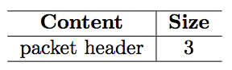
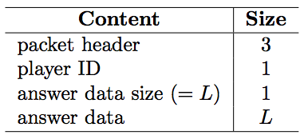
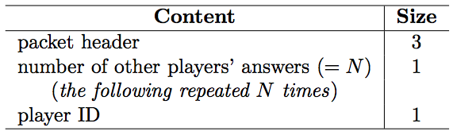
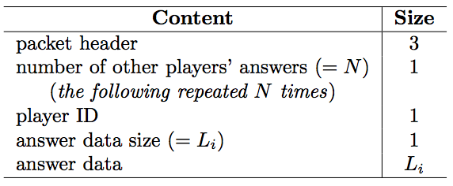
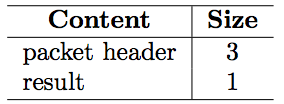

## 문제

ICPC (Internet Contents Providing Company) is working on a killer game named Quiz Millionaire Attack. It is a quiz system played over the Internet. You are joining ICPC as an engineer, and you are responsible for designing a protocol between clients and the game server for this system. As bandwidth assigned for the server is quite limited, data size exchanged between clients and the server should be reduced as much as possible. In addition, all clients should be well synchronized during the quiz session for a simultaneous play. In particular, much attention should be paid to the delay on receiving packets.

To verify that your protocol meets the above demands, you have decided to simulate the communication between clients and the server and calculate the data size exchanged during one game.

A game has the following process. First, players participating and problems to be used are fixed. All players are using the same client program and already have the problem statements downloaded, so you don’t need to simulate this part. Then the game begins. The first problem is presented to the players, and the players answer it within a fixed amount of time. After that, the second problem is presented, and so forth. When all problems have been completed, the game ends. During each problem phase, the players are notified of what other players have done. Before you submit your answer, you can know who have already submitted their answers. After you have submitted your answer, you can know what answers are submitted by other players.

When each problem phase starts, the server sends a synchronization packet for problem-start to all the players, and begins a polling process. Every 1,000 milliseconds after the beginning of polling, the server checks whether it received new answers from the players strictly before that moment, and if there are any, sends a notification to all the players:

* If a player hasn’t submitted an answer yet, the server sends it a notification packet type A describing others’ answers about the newly received answers.
* If a player is one of those who submitted the newly received answers, the server sends it a notification packet type B describing others’ answers about all the answers submitted by other players (i.e. excluding the player him/herself’s answer) strictly before that moment.
* If a player has already submitted an answer, the server sends it a notification packet type B describing others’ answers about the newly received answers.
* Note that, in all above cases, notification packets (both types A and B) must contain information about at least one player, and otherwise a notification packet will not be sent.

When 20,000 milliseconds have passed after sending the synchronization packet for problem-start, the server sends notification packets of type A or B if needed, and then sends a synchronization packet for problem-end to all the players, to terminate the problem.

On the other hand, players will be able to answer the problem after receiving the synchronization packet for problem-start and before receiving the synchronization packet for problem-end. Answers will be sent using an answer packet.

The packets referred above have the formats shown by the following tables.

  
Table 1: Syncronization packet for problem-start

  
Table 2: Answer packet

  
Table 3: Notification packet type A describing others’ answers

  
Table 4: Notification packet type B describing others’ answers

  
Table 5: Syncronization packet for problem-end

## 입력

The input consists of multiple test cases. Each test case begins with a line consisting of two integers M and N (1 ≤ M, N ≤ 100), denoting the number of players and problems, respectively. The next line contains M non-negative integers D0, D1, . . . , DM−1, denoting the communication delay between each players and the server (players are assigned ID’s ranging from 0 to M − 1, inclusive). Then follow N blocks describing the submissions for each problem. Each block begins with a line containing an integer L, denoting the number of players that submitted an answer for that problem. Each of the following L lines gives the answer from one player, described by three fields P, T, and A separated by a whitespace. Here P is an integer denoting the player ID, T is an integer denoting the time elapsed from the reception of synchronization packet for problem-start and the submission on the player’s side, and A is an alphanumeric string denoting the player’s answer, whose length is between 1 and 9, inclusive. Those L lines may be given in an arbitrary order. You may assume that all answer packets will be received by the server within 19,999 milliseconds (inclusive) after sending synchronization packet for problem-start.

The input is terminated by a line containing two zeros.

## 출력

For each test case, you are to print M + 1 lines. In the first line, print the data size sent and received by the server, separated by a whitespace. In the next M lines, print the data size sent and received by each player, separated by a whitespace, in ascending order of player ID. Print a blank line between two consecutive test cases.
