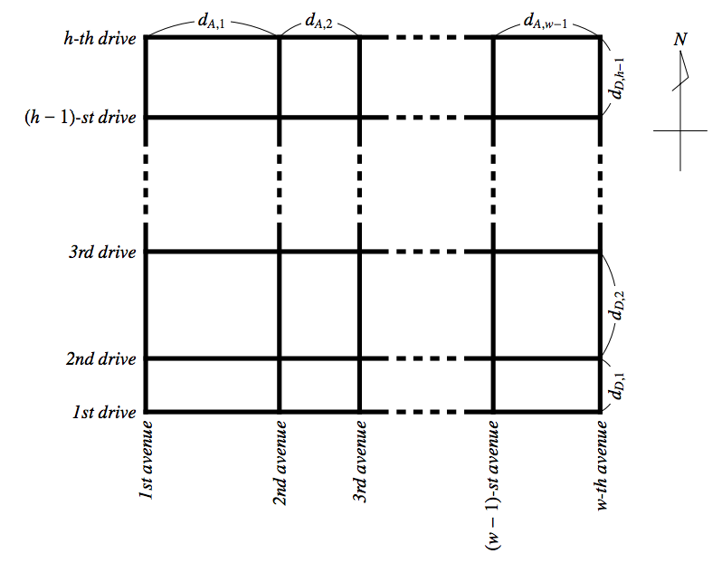
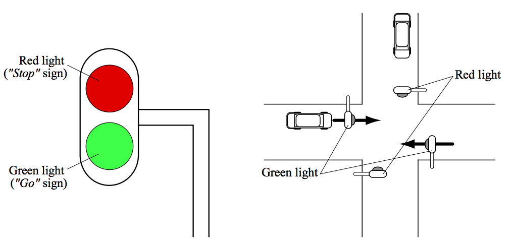

## 문제

You are a resident of Kyoot (oh, well, it’s not a misspelling!) city. All streets there are neatly built on a grid; some streets run in a meridional (north-south) direction and others in a zonal (east-west) direction. The streets that run from north to south are called avenues, whereas those which run from east to west are called drives.

Every avenue and drive in the city is numbered to distinguish one from another. The westernmost avenue is called the 1st avenue. The avenue which lies next to the 1st avenue is the 2nd avenue, and so forth. Similarly, drives are numbered from south to north. The figure below illustrates this situation.

  
Figure 3: The Road Map of the Kyoot City

There is an intersection with traffic signals to regulate traffic on each crossing point of an avenue and a drive. Each traffic signal in this city has two lights. One of these lights is colored green, and means “you may go”. The other is red, and means “you must stop here”. If you reached an intersection during the red light (including the case where the light turns to red on your arrival), you must stop and wait there until the light turns to green again. However, you do not have to wait in the case where the light has just turned to green when you arrived there.

Traffic signals are controlled by a computer so that the lights for two different directions always show different colors. Thus if the light for an avenue is green, then the light for a drive must be red, and vice versa. In order to avoid car crashes, they will never be green together. Nor will they be red together, for efficiency. So all the signals at one intersection turn simultaneously; no sooner does one signal turn to red than the other turns to green. Each signal has a prescribed time interval and permanently repeats the cycle.

  
Figure 4: Signal and Intersection

By the way, you are planning to visit your friend by car tomorrow. You want to see her as early as possible, so you are going to drive through the shortest route. However, due to existence of the traffic signals, you cannot easily figure out which way to take (the city also has a very sophisticated camera network to prevent crime or violation: the police would surely arrest you if you didn’t stop on the red light!). So you decided to write a program to calculate the shortest possible time to her house, given the town map and the configuration of all traffic signals.

Your car runs one unit distance in one unit time. Time needed to turn left or right, to begin moving, and to stop your car is negligible. You do not need to take other cars into consideration.

## 입력

The input consists of multiple test cases. Each test case is given in the format below:

```

w h 
dA,1 dA,2 . . . dA,w−1 
dD,1 dD,2 . . . dD,h−1 
ns1,1 ew1,1 s1,1 
. . . 
nsw,1 eww,1 sw,1 
ns1,2 ew1,2 s1,2 
. . . 
nsw,h eww,h sw,h 
xs ys 
xd yd
```

Two integers w and h (2 ≤ w, h ≤ 100) in the first line indicate the number of avenues and drives in the city, respectively. The next two lines contain (w − 1) and (h − 1) integers, each of which specifies the distance between two adjacent avenues and drives. It is guaranteed that 2 ≤ dA,i, dD,j ≤ 1, 000.

The next (w × h) lines are the configuration of traffic signals. Three parameters nsi,j , ewi,j and si,j describe the traffic signal (i, j) which stands at the crossing point of the i-th avenue and the j-th drive. nsi,j and ewi,j (1 ≤ nsi,j , ewi,j < 100) are time intervals for which the light for a meridional direction and a zonal direction is green, respectively. si,j is the initial state of the light: 0 indicates the light is green for a meridional direction, 1 for a zonal direction. All the traffic signal have just switched the state to si,j at your departure time.

The last two lines of a case specify the position of your house (xs, ys) and your friend’s house (xd, yd), respectively. These coordinates are relative to the traffic signal (0, 0). x-axis is parallel to the drives, and y-axis is parallel to the avenues. x-coordinate increases as you go east, and y-coordinate increases as you go north. You may assume that these positions are on streets and will never coincide with any intersection.

All parameters are integers and separated by a blank character.

The end of input is identified by a line containing two zeros. This is not a part of the input and should not be processed.

## 출력

For each test case, output a line containing the shortest possible time from your house to your friend’s house.
