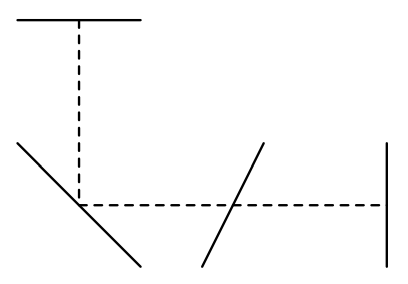

## 문제

Automobile Company Moving has developed a new ride for switchbacks. The most impressive feature of this machine is its mobility that we can move and turn to any direction at the same speed.

As the promotion of the ride, the company started a new competition named the extreme slalom. A course of the extreme slalom consists of some gates numbered from 1. Each gate is represented by a line segment. A rider starts at the first gate and runs to the last gate by going through or touching the gates in the order of their numbers. Going through or touching gates other than the target one is allowed but not counted.

Your team is going to participate at the next competition. To win the competition, it is quite important to run on the shortest path. Your task is to write a program that computes the shortest length to support your colleagues.

  
Figure 7: An Example Course for the Extreme Slalom

## 입력

The input consists of a number of courses.

The first line of a course is an integer indicating the number n (2 ≤ n ≤ 12) of gates. The following n lines specify the gates in the order of traversals. A line contains four integers x1, y1, x2, and y2 (0 ≤ x1, y1, x2, y2 ≤ 100) specifying the two endpoints of the gate. You may assume that no couple of gates touch or intersect each other.

The end of the input is indicated by a line containing a single zero.

## 출력

Print the shortest length out in one line for each course. You may print an arbitrary number of digits after the decimal points provided that difference from the exact answer is not greater than 0.0001.
