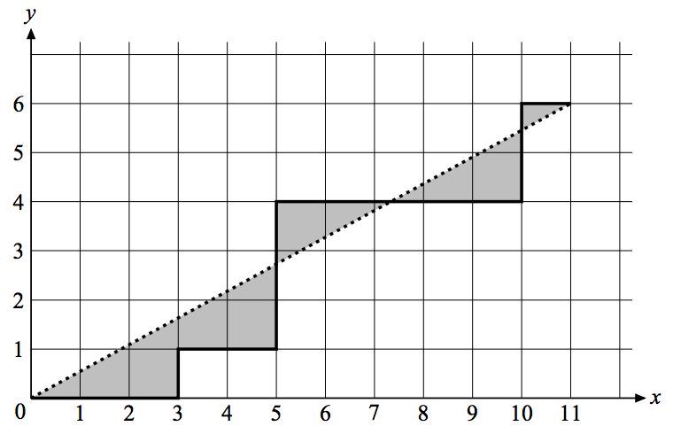

## 문제

Consider a 2D path drawn in the following manner: Starting at the origin point, we can move only up or right. The path will be described as a string made of zero or more {‘U’, ‘R’} letters. For each ‘U’ we’ll move one unit up, while ‘R’ moves one unit to the right. In the following figure, the path constructed by the string RRRURRUUURRRRRUUR is drawn in a thick line.

  
Figure 1: Sample 2D Path

Imagine now that we draw a straight line that connects the origin point to the last point in the path (the line that is drawn in dots in the figure above). We want to compute the total area that falls between the straight line and the path (the grayed area in the above figure).

## 입력

The input consists of one or more test cases. Each case is described on a separate line. The path of each test case is described as a string made of one or more letters, each of which is either ‘U’ or ‘R’, followed by the letter ‘S’.

All paths in the input can be drawn on a grid of size 1000 × 1000.

The last line of the input is made of a single ‘S’ character and is not part of the test cases.

## 출력

For each case, write the area on a line. The area may have an arbitrary number of decimal digits, but may not contain an error greater than 10−3 .
