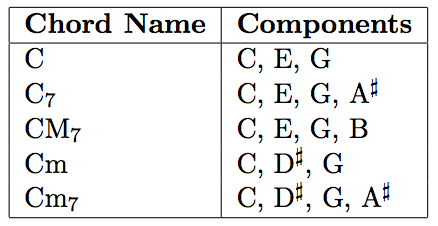
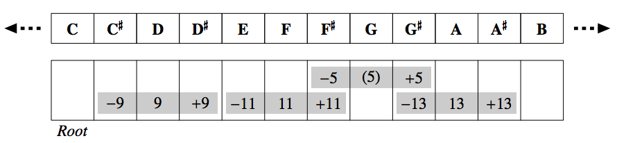
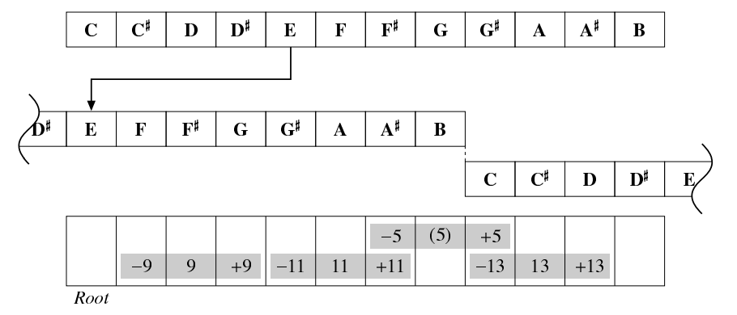
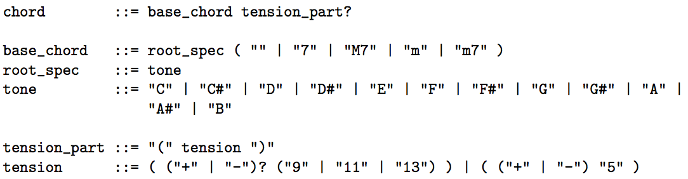

## 문제

In this problem, you are required to write a program that enumerates all chord names for given tones.

We suppose an ordinary scale that consists of the following 12 tones:

C, C# , D, D# , E, F, F# , G, G#, A, A# , B

Two adjacent tones are different by a half step; the right one is higher. Hence, for example, the tone G is higher than the tone E by three half steps. In addition, the tone C is higher than the tone B by a half step. Strictly speaking, the tone C of the next octave follows the tone B, but octaves do not matter in this problem.

A chord consists of two or more different tones, and is called by its chord name. A chord may be represented by multiple chord names, but each chord name represents exactly one set of tones.

In general, a chord is represented by a basic chord pattern (base chord) and additional tones (tension) as needed. In this problem, we consider five basic patterns as listed below, and up to one additional tone.

  
Figure 2: Base chords (only shown those built on C)

The chords listed above are built on the tone C, and thus their names begin with C. The tone that a chord is built on (the tone C for these chords) is called the root of the chord.

A chord specifies its root by an absolute tone, and its other components by tones relative to its root. Thus we can obtain another chord by shifting all components of a chord. For example, the chord name D represents a chord consisting of the tones D, F] and A, which are the shifted-up tones of C, E and G (which are components of the chord C) by two half steps.

An additional tone, a tension, is represented by a number that may be preceding a plus or minus sign, and designated parentheses after the basic pattern. The figure below denotes which number is used to indicate each tone.

  
Figure 3: Tensions for C chords

For example, C(9) represents the chord C with the additional tone D, that is, a chord that consists of C, D, E and G. Similarly, C(+11) represents the chord C plus the tone F# .

The numbers that specify tensions denote relative tones to the roots of chords like the components of the chords. Thus change of the root also changes the tones specified by the number, as illustrated below.

  
Figure 4: Tensions for E chords

+5 and −5 are the special tensions. They do not indicate to add another tone to the chords, but to sharp (shift half-step up) or flat (shift half-step down) the fifth tone (the tone seven half steps higher than the root). Therefore, for example, C(+5) represents a chord that consists of C, E and G# , not C, E, G and G# .

Figure 5 describes the syntax of chords in Backus-Naur Form.

Now suppose we find chord names for the tones C, E and G. First, we easily find the chord C consists of the tones C, E and G by looking up the base chord table shown above. Therefore ‘C’ should be printed. We have one more chord name for those tones. The chord Em obviously represents the set of tones E, G and B. Here, if you sharp the tone B, we have the set of tones E, G and C. Such modification can be specified by a tension, +5 in this case. Thus ‘Em(+5)’ should also be printed.

  
Figure 5: Syntax of chords in BNF

## 입력

The first line of input contains an integer N, which indicates the number of test cases.

Each line after that contains one test case. A test case consists of an integer m (3 ≤ m ≤ 5) followed by m tones. There is exactly one space character between each tones. The same tone does not appear more than once in one test case.

Tones are given as described above.

## 출력

Your program should output one line for each test case.

It should enumerate all chord names that completely match the set of tones given as input (i.e. the set of tones represented by each chord name must be equal to that of input) in any order.

No chord name should be output more than once. Chord names must be separated by exactly one space character. No extra space is allowed.

If no chord name matches the set of tones, your program should just print ‘UNKNOWN’ (note that this word must be written in capital letters).
