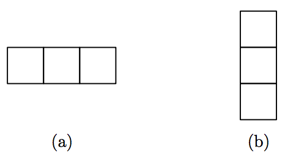
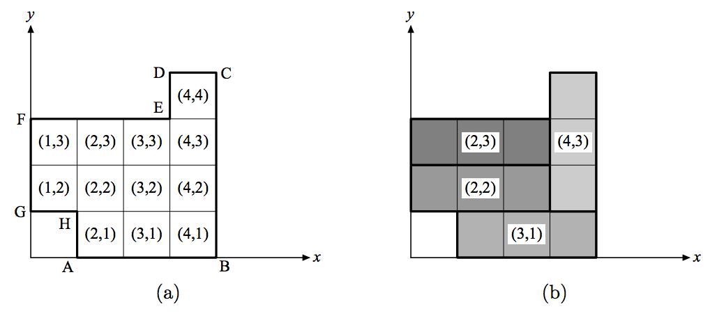
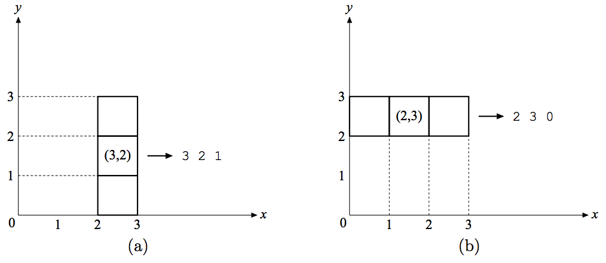

## 문제

In a polygon tiling game, you are required to fill a polygon with a set of basic shapes called tiles. This is equivalent to cutting up the entire polygon into a number of small pieces; each piece must have exactly the same shape as one of the provided tiles. Let us consider a simple version of the game. Two types of rectangular tiles are given as shown in Figure 7. Their width/height are 1/3 and 3/1 respectively. You are asked to use these two types of tiles to tile a rectilinear polygon (that is, a polygon with only vertical or horizontal edges). For instance, Figure 8(a) shows such a polygon and Figure 8(b) shows how it can be properly tiled with three 3 × 1 tiles and one 1 × 3 tile.

  
Figure 7: 1 × 3 tile and 3 × 1 tile

The coordinate system used in this game is described by the following rules:

1. A polygon is always positioned in such a way that its lowest edge is on the x-axis and its leftmost edge is on the y-axis, as shown in Figure 8.
2. A polygon is represented by an ordered list of points that enumerates all of its vertices. The enumeration starts from the lower-left vertex (i.e. the leftmost vertex lying on x-axis) and proceeds counterclockwise. For instance, the polygon in Figure 8(a) is represented by the sequence of points [A, B, C, D,E, F, G, H].
3. A grid (a rectangle whose width and height are both one) is represented by a pair (x, y), where x and y are the x-coordinate and y-coordinate of its top-right vertex. In Figure 8(a), the coordinate of every grid is indicated inside the grid.
4. A tile is designated by a triple (x, y, z), where x and y are the coordinates of the middle grid of the tile and z represents the orientation of the tile. If the tile is horizontal, then z = 0; otherwise z = 1. Figure 9 gives two examples.

Your task is to write a program that finds a way to tile a given polygon. The polygon is known to be tillable. If there is more than one ways of tiling, you are only required to find one of them.

  
Figure 8: An example of tiling

  
Figure 9: An example of tiling

## 입력

Input consists of multiple test cases.

Each case describes a polygon to be tiled. The first line contains a single integer N (4 ≤ N < 100) that denotes the number of vertices of the polygon. The subsequent N lines specify the vertices of the polygon in the order stated above; one line per vertex. A vertex is specified as its x-coordinate followed by its y-coordinate, separated by a white space.

You may assume the area of a polygon is always less than 1000, as well as each coordinate value is an integer less than 100.

A line that contains a single zero indicates the end of input, and this line should not be processed.

The sample input below denotes the polygon shown in Figure 8(a).

## 출력

For each case, the output produces a list of tiles that fills the polygon specified in the input file. A tile is specified as a triple x y z as described above, separated by a white space; one tile per line. The tiles may appear in any order.

Print a blank line between cases.

The sample output below represents the solution shown in Figure 8(b).
