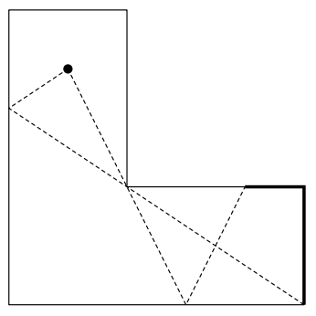

## 문제

You are given plans of rooms of polygonal shapes. The walls of the rooms on the plans are placed parallel to either x-axis or y-axis. In addition, the walls are made of special materials so they reflect light from sources as mirrors do, but only once. In other words, the walls do not reflect light already reflected at another point of the walls.

Now we have each room furnished with one lamp. Walls will be illuminated by the lamp directly or indirectly. However, since the walls reflect the light only once, some part of the walls may not be illuminated.

You are requested to write a program that calculates the total length of unilluminated part of the walls.

  
Figure 10: The room given as the second case in Sample Input

## 입력

The input consists of multiple test cases.

The first line of each case contains a single positive even integer N (4 ≤ N ≤ 20), which indicates the number of the corners. The following N lines describe the corners counterclockwise. The i-th line contains two integers xi and yi , where (xi , yi) indicates the coordinates of the i-th corner. The last line of the case contains x' and y' , where (x' , y') indicates the coordinates of the lamp.

To make the problem simple, you may assume that the input meets the following conditions:

* All coordinate values are integers not greater than 100 in their absolute values.
* No two walls intersect or touch except for their ends.
* The walls do not intersect nor touch each other.
* The walls turn each corner by a right angle.
* The lamp exists strictly inside the room off the wall.
* The x-coordinate of the lamp does not coincide with that of any wall; neither does the y-coordinate.

The input is terminated by a line containing a single zero.

## 출력

For each case, output the length of the unilluminated part in one line. The output value may have an arbitrary number of decimal digits, but may not contain an error greater than 10−3 .
