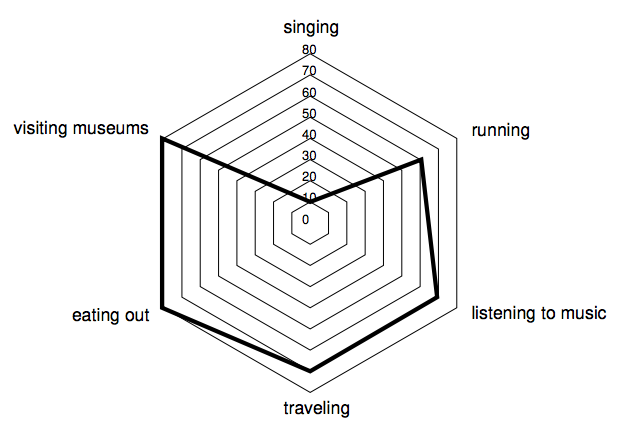
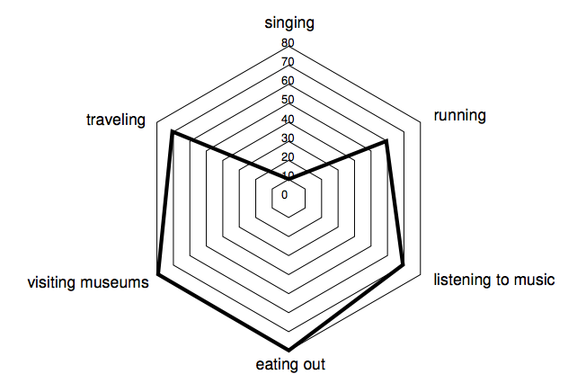

## 문제

Alex registered in an online dating system to search for the perfect partner. The system requires each of its members to fill a form specifying how much they enjoy N different activities, grading them on a scale from 0 to 100. To present this information to potential dates, the system creates a profile featuring a special kind of polygon called “radial diagram”.

A radial diagram for N activities is drawn by marking N points on the plane. Starting from the vertical direction, the i-th point in clockwise order represents the i-th activity specified by the member, and is a distance Si away from the center of the diagram, where Si is the score given by the member for the corresponding activity. The angle sustained at the center of the diagram from each pair of consecutive points is always the same, and the polygon is formed by drawing the segments whose endpoints are consecutive points. Note that for the purposes of the radial diagram, the first and last points are considered to be consecutive.

For example, if N = 6 Alex might specify the following activities: singing with score S1 = 10, running with score S2 = 60, listening to music with score S3 = 70, traveling with score S4 = 70, eating out with score S5 = 80, and visiting museums with score S6 = 80. Then the corresponding radial diagram would be as shown in the figure below.

The area of a radial diagram depends on the order in which the different activities are specified, and Alex suspects that a profile depicting a radial diagram with greater area might be more successful. For example, the radial diagram in the following figure features the same activities and scores as the example above, but has a greater area.

Alex has asked you to write a program to find the maximum possible area of a radial diagram given a list of activities graded with scores between 0 and 100.

## 입력

The first line contains an integer N representing the number of activities (3 ≤ N ≤ 105 ). The second line contains N integers S1, S2, . . . , SN representing the scores given by Alex to each activity (0 ≤ Si ≤ 100 for i = 1, 2, . . . , N)

## 출력

Output a line with a rational number representing the maximum possible area of a radial diagram featuring the scores given in the input. The result must be output as a rational number with exactly 3 digits after the decimal point, rounded if necessary.
