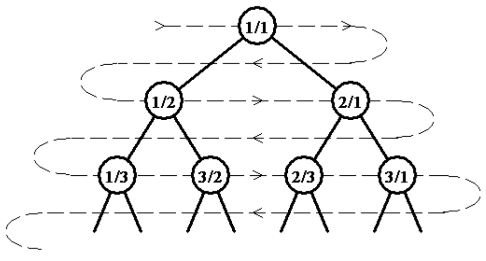

## 문제

An infinite full binary tree labeled by positive rational numbers is defined by:

* The label of the root is 1/1.
* The left child of label p/q is p/(p+q).
* The right child of label p/q is (p+q)/q.

The top of the tree is shown in the following figure:



A rational sequence is defined by doing a level order (breadth first) traversal of the tree (indicated by the light dashed line). So that:

```

F(1) = 1/1, F(2) = 1/2, F(3) = 2/1, F(4) = 1/3, F(5) = 3/2, F(6) = 2/3, …
```

Write a program to compute the nth element of the sequence, F(n). Does this problem sound familiar? Well it should! We had variations of this problem at the 2014 and 2015 Greater NY Regionals.

## 입력

The first line of input contains a single integer P, (1 ≤ P ≤ 1000), which is the number of data sets that follow.

Each data set should be processed identically and independently. Each data set consists of a single line of input. It contains the data set number, K, and the index, N, of the sequence element to compute (1 <= N <= 2147483647).

## 출력

For each data set there is a single line of output. It contains the data set number, K, followed by a single space which is then followed by the numerator of the fraction, followed immediately by a forward slash (‘/’) followed immediately by the denominator of the fraction. Inputs will be chosen so neither the numerator nor the denominator will overflow an 32-bit unsigned integer.
