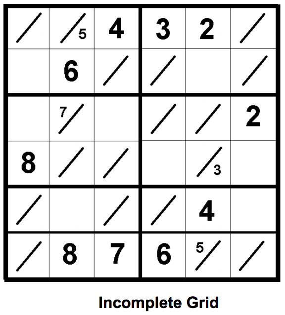
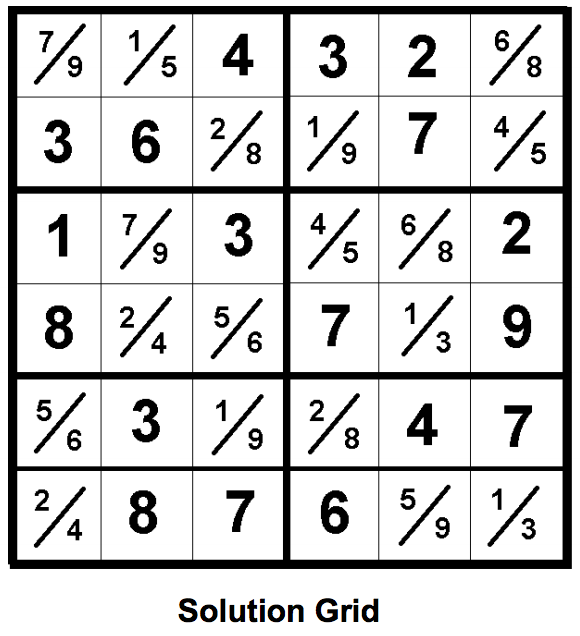

## 문제

At some point or another, most computer science students have written a standard Sudoku solving program. A slight twist has been added to standard Sudoku to make it a bit more challenging.

Digits from 1 to 9 are entered in a 6x6 grid so that no number is repeated in any row, column or 3x2 outlined region as shown below. Some squares in the grid are split by a slash and need 2 digits entered in them. The smaller number always goes above the slash.

For this problem, you will write a program that takes as input an incomplete puzzle grid and outputs the puzzle solution grid.

## 입력

The first line of input contains a single decimal integer P, (1 ≤ P ≤ 100), which is the number of data sets that follow.

Each data set should be processed identically and independently. Each data set consists of 7 lines of input. The first line of the data set contains the data set number, K. The remaining 6 lines represent an incomplete Tight-Fit Sudoku grid, each line has 6 data elements, separated by spaces. A data element can be a digit (1-9), a dash (‘-‘) for a blank square or two of these separated by a slash (‘/’).

## 출력

For each data set there are 7 lines of output. The first output line consists of the data set number, K. The following 6 lines of output show the solution grid for the corresponding input data set. Each line will have 6 data elements, separated by spaces. A data element can be a digit (1-9), or 2 digits separated by a slash (‘/’).
