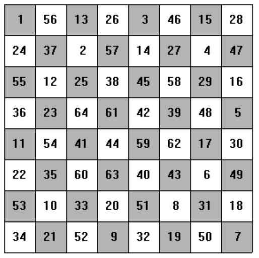
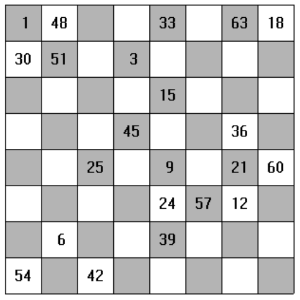

## 문제

A knight’s tour on a rectangular board of n rows and m columns of squares (traditionally 8-by-8) is a labelling of the squares by integers 1 through n\*m so that label (n+1) is a knight’s move from label n. That is, 2 squares horizontally and 1 square vertically or 1 square horizontally and 2 squares vertically. The image below shows an 8-by-8 knight’s tour.

A knight’s tour (on a square board) is (semi-)magical if the sum of the values in each row and column is the same (for the 8-by-8 case the sum would be 260). For this problem, you will be given a sequence of semi-magical 8-by-8 knight’s tours with many of the labels removed (see the image below). Write a program to fill in the missing labels so the knight’s tour is semi-magical.

## 입력

The first line of input contains a single decimal integer P, (1 ≤ P ≤ 10000), which is the number of data sets that follow.

Each data set should be processed identically and independently. Each data set consists of a multiple lines of input. The first line of each data set contains the data set number, K. This line is followed by 8 lines each containing 8 integers separated by spaces giving the labels for the corresponding row. If the label value is -1, the label has been removed and your program is to find the correct value to put in that place.

## 출력

For each data set there are 9 lines of output. The first output line contains the data set number, K. The following 8 lines should contain 8 integers each, separated by spaces, filling in the removed values to give a complete semi-magical knight’s tour which includes the positive labels from the input. There may be multiple correct answers. Your result will be graded correct if it is a semi-magical knight’s tour and the positive labels from the input are in the same square in your answer.
