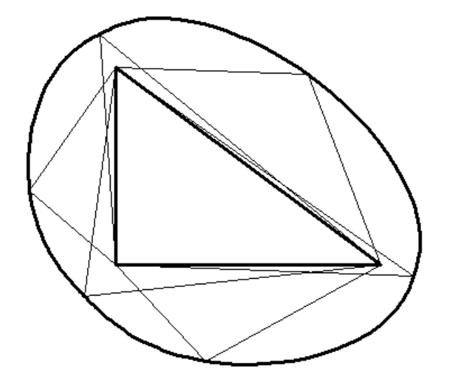
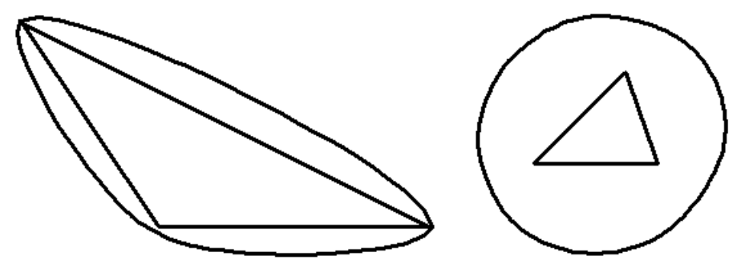

## 문제

The Flathead Fancy Landscaping Company’s customers are too high-class to have gardens with straight edges so Joe P. Flathead, the owner, has come up with a way to smooth out the contours. He puts a stake in each corner of a triangular plot and drops a loop of rope around the three stakes. Then using a fourth stake in the loop, he pulls the rope tight to mark out a smoothed version of the triangle (see the figure below, the thinner lines are various positions of the rope). This process is similar to the method you learned in middle school to draw an ellipse using 2 push-pins, a piece of string and a pencil, but J.P. Flathead is using three stakes (not two), a rope and another stake instead of a pencil.

The longer the rope loop, the smoother the outline will be (see the examples below):

In order to determine how much soil and how many plants are required for the garden, Joe needs to find out the area of the resulting smoothed outline.

For this problem you will write a program which takes as input the coordinates of the corners of the triangle and the length of the rope loop and outputs the area of the smoothed region. The coordinate system will be chosen so that the first vertex is at the origin (A(0, 0)), the x-axis is along the line from the first vertex to the second vertex (B(Bx, 0)) and the final vertex is above the x-axis (C(Cx, Cy)).

## 입력

The first line of input contains a single decimal integer P, (1 ≤ P ≤ 10000), which is the number of data sets that follow.

Each data set should be processed identically and independently. Each data set consists of a single line of input. It contains the data set number, K, followed by a single space, followed by 4 floating point values Bx, Cx, Cy, (Bx > 0, Cy > 0), and the rope length L all measured in feet.

## 출력

For each data set there is one line of output. The single output line consists of the data set number, K, followed by a single space followed by the area of the smoothed region in square feet accurate to 2 decimal places.
