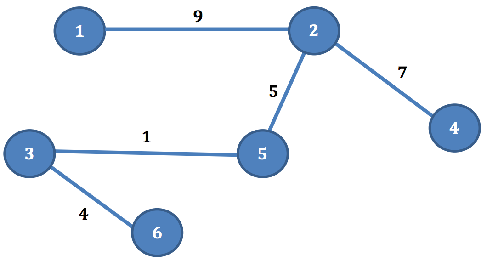

## 문제

Mr. Peter lives in the magical lands of ACM City. The city consists of N districts and N – 1 two-way roads. Each road connects a pair of districts, and for each road we know the length of the road. All districts are connected to each other, meaning Mr. Peter can always travel from any district A to any district B.

The ACM City has a very special rule for travelling. If anyone wants to travel from district A to district B, they must pay the tax equal to the median of the length of all roads from district A to district B. For example, this ACM City of 6 districts.

All circles represent districts and lines represent roads connecting two districts. Numbers inside the circles are the number of each district and numbers above the lines are the length of each road. If Mr. Peter travels from district 1 to district 3, the length of all roads would be 1, 5, and 9, therefore he must pay the tax of 5 dollars. However, if Mr. Peter travels from district 6 to district 4, he must pay 4.5 dollars, for the length of the roads are 1, 4, 5, and 7.

Mr. Peter is a very curious person. He wants to know the tax he needs to pay to travel from any two districts. However, Mr. Peter is too lazy to calculate the tax himself, so he asks you, the best programmer in the city, to calculate the tax Mr. Peter needs to pay from district A to district B.

Note: The ‘Median’ is the middle value of a sorted list of numbers. For example, the median of the list 1, 5, 7, 7, 9, 10, 16 is 7. If the amount of numbers in the list is even, the median is the sum of two middle numbers divided by 2. For example, the median of the list 1, 5, 7, 9, 10, 17, 28, 30 is (9+10)/2, which is 9.5.

Given the ACM City of N districts, for each question, find the median of the length of all path from district A to district B.

## 입력

The first line contains number of test case T (T ≤ 15). Then for each test case:

The first line contains one integer N (2 ≤ N ≤ 50 000) — the number of districts.

The next N – 1 lines contain three integers Ui, Vi, Wi (1 ≤ Ui, Vi ≤ N, Ui ≠ Vi, 1 ≤ Wi ≤ 100 000) — the roads connecting district Ui, and Viwith the length Wi .

The next line contains one integer Q (1 ≤ Q ≤ 100 000) — the number of questions Mr. Peter wants to ask.

The next Q lines contain two integers Ai, Bi (1 ≤ Ai, Bi ≤ N, Ai ≠ Bi) — the questions Mr. Peter wants to ask how much he needs to pay to travel from district Ai to district Bi.

## 출력

Print Q lines. In each line contains one real number with one digit after the decimal point — the tax Mr. Peter needs to pay to travel from district Ai to district Bi.
