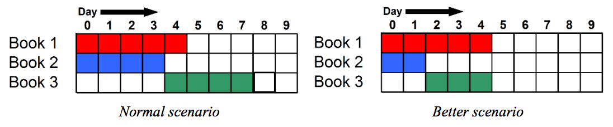

## 문제

A book publisher needs to print N books in X days. Though normally books can be published in parallel, but for some reason the publisher imposes restriction on some books i.e. you cannot start publishing on Harry Potter 2 before publishing Harry Potter 1. There are M restrictions in (u, v) format, which means the printing process of the vth book can start after the uth book is published. It takes Ai days to publish the i th book and the cost of this publishing is Ci. But if the publisher provides the printing presses additional resources like printing machine then the publication time of the i th book can be reduced by Ri days, but the total time must not be less than Bi days (Ai - Ri ≥ Bi), that means the book will take Ai - Ri days to publish instead of Ai days. But to reduce a single day the publisher has to pay extra Di amount of money.

For the 3rd sample test case: In normal scenario, it will take 8 days to publish all the three books. But if we reduce 2 days for Book 2 and 1 day for Book 3 then, all of the three books can be published within 5 days.



You have to calculate the minimum amount of money the publisher has to spend to print all the N books within X days.

## 입력

First line of the input contains an integer T (T ≤ 300), denoting the number of test cases to follow. Each test case will maintain the following format:

```

N X 
A1 A2 … AN 
B1 B2 … BN 
C1 C2 … CN 
D1 D2 … DN 
M 
u1 v1 
… 
uM vM
```

Where Ai (1 ≤ Ai ≤ 1 000 000), Bi (1 ≤ Bi ≤ Ai), Ci (1 ≤ Ci ≤ 1 000 000), Di (0 ≤ Di ≤ 100) has been described above. M (0 ≤ M ≤ N\*(N-1)/2) is the number of restrictions and integers ui and vi (1 ≤ ui, vi ≤ N) denote that the publishing of vith book cannot start before uith book has been published. There will be no cyclic restriction in the input.

Constraint on N:

* 85% test cases: N ≤ 30
* 3 test cases: N = 200
* Rest of the test cases: 30 ≤ N ≤ 100

## 출력

First line of each test case will contain the test case number and “Impossible”, if it is not possible to print all the N books within X days. Otherwise output will contain 2×N + 1 integers, first of them is the minimum cost to publish all the N books within X days and next N pairs of integers are Si and Ri (0 ≤ Si, Ri ≤ 10 000 000), where Si is the starting day of publishing of ith book and Ri is the number of days reduced to print the ith book. If there are more than one possible answers print any one of them.

## 힌트

In the first test case, without any extra resources, it will take 5 + 3 = 8 days to complete both the books. But the publisher needs to print the books within 6 days. With additional resources, first book will start on 0th day and continue till 0 + 4 – 1 = 3rd day and the second book will start on 4th day and continue till 4 + 2 – 1 = 5th day and it will cost 1×1 + 1×1 = 2 unit extra and the total cost is initial cost + extra cost = 3 + 2 = 5.
