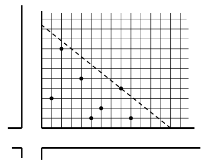

## 문제

Two straight roads A and B perpendicular to each other start at the common crossing. Road A runs eastward and road B runs northward.

The roads are part of a large industrial system being built in the area and they should be connected by a special high frequency cable. Unfortunately, the connection cannot be built directly at the intersection. Additionally, there are some buildings standing in the corner of the field bordered by the roads. The buildings represent obstacles to the cable.

After some negotiations and considering various technical limitations, the analysts of the cable company constructed a set of critical points, determined by the obstacles. Then they suggested that the cable should connect the roads in a way that satisfies the following criteria:

* The cable should run in a straight line.
* The cable should not run between any critical point and the corner of the field at the roads crossing.
* The length of the cable should be the minimum possible.

Now, your task is to determine the length of the cable.

## 입력

There are more test cases. Each case starts with a line containing one integer N (1 ≤ N ≤ 106 ) which specifies the number of critical points. Next, there are N lines representing the points, each line describes one of them. A point P is represented by two integers a, b (1 ≤ a, b ≤ 10 000) separated by space. Integer a is the distance from P to road A and integer b is the distance from P to road B. All distances are in meters. You may suppose that the lengths of the roads and also the size of the field are not limited. All coordinate pairs (a, b) in one test case are unique.

## 출력

For each test case, print a single line with one floating point number L denoting the minimum possible length of the cable expressed in meters. L should be printed with the maximum allowed error of 10−3 .
