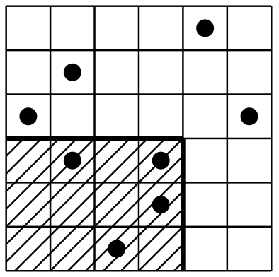

## 문제

Uncle Oliver is going to sell a significant part of his famous dwarf plum tree orchard. He is going to divide the orchard into two parts, sell the first one and keep the other one.

The trees were originally planted in regular rows and columns forming a rectangular grid with the same number of rows and columns. As years went by, Oliver removed many trees which were weak or plagued by bugs so nowadays there is also a lot of free squares unoccupied by any tree.

Oliver has decided that he will keep exactly half of all the trees in the orchard. Moreover, he has few additional demands which, in his opinion, will ensure easy maintenance of his part in the future.

* The part Oliver is going to keep should be in the shape of a rectangle.
* A least one corner of the rectangle should coincide with a corner of the orchard.
* The rectangle area should be as small as possible.

Originally, each tree was planted in the center of an imaginary square whose area was exactly one square meter. Thus, the position of each tree can be described by the coordinates of the square on which it is standing. The dividing fence between the two parts of the orchard will run along the borders of the squares.

## 입력

There are more test cases. Each case starts with a line containing two integers M (1 ≤ M ≤ 109 ) and N (1 ≤ N ≤ 106 ) separated by space. The orchard side length in meters is expressed by M and the number of trees in the orchard is expressed by N. Next, there are N lines, each line specifies x and y coordinates of one tree in the orchard. The coordinates are separated by space. For simplicity reasons, we assume that the coordinates are zero based, so the coordinates of the squares in the corners of the orchard are (0, 0),(0, M − 1),(M − 1, M − 1),(M − 1, 0). All coordinate pairs (x, y) in one test case are unique.

## 출력

For each test case, print a single line with one whole number A denoting the minimum possible area in square meters of uncle Oliver’s part of the orchard. If it is not possible to divide the orchard according to Oliver’s demands print “-1”. Note that the output value might not fit into 32-bit integer type.
