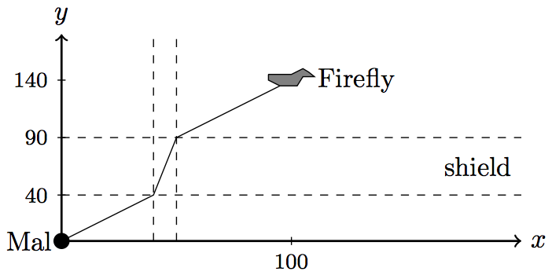

## 문제

That went well! As police sirens rang out around the palace, Mal Reynolds had already reached his lifting device outside of the city.

No spaceship can escape Planet Zarzos without permission from the High Priest. However, Mal’s spaceship, Firefly, is in geostationary orbit well above the controlled zone and his small lifting device can avoid being recognised as an intruder if its vertical velocity is exactly 1 km/min.

There are still two problems. First, Mal will not be able to control the vehicle from his space suit, so he must set up the autopilot while on the ground. The vertical velocity must be exactly 1 km/min and the horizontal velocity must be set in such a way that Mal will hit the Firefly on the resulting trajectory. Second, the energy shields of the planet disturb the autopilot: They will decrease or increase the horizontal velocity by a given factor. The original horizontal velocity is restored as soon as there is no interference. For this problem we consider Firefly to be a single point – the shape shown in Figure C.1 is merely for decorative purposes.

Figure C.1: Illustration of Sample Input 1.

Luckily, Mal recorded the positions of the shields and their influence on the autopilot during his descent. What he needs now is a program telling him the right horizontal velocity setting.

## 입력

The input consists of:

* one line with two integers x, y (−107 ≤ x ≤ 107 , |x| ≤ y ≤ 108 and 1 ≤ y), Firefly’s coordinates relatively to Mal’s current position (in kilometres).
* one line with an integer n (0 ≤ n ≤ 100), the number of shields.
* n lines describing the n shields, the ith line containing three numbers:
  + an integer li (0 ≤ li < y), the lower boundary of shield i (in kilometres).
  + an integer ui (li < ui ≤ y), the upper boundary of shield i (in kilometres).
  + a real value fi (0.1 ≤ fi ≤ 10.0), the factor with which the horizontal velocity is multiplied during the traversal of shield i.

It is guaranteed that shield ranges do not intersect, i.e., for every pair of shields i ≠ j either ui ≤ lj or uj ≤ li must hold.

All real numbers will have at most 10 digits after the decimal point.

## 출력

Output the horizontal velocity in km/min which Mal must choose in order to reach Firefly. The output must be accurate to an absolute or relative error of at most 10−6 .
