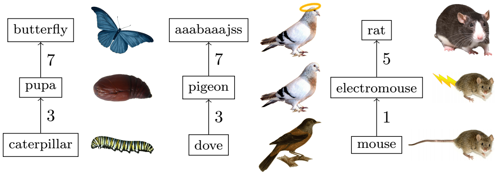

## 문제

Nudgémon GO is a game in which players should earn as much experience points (XP) as possible, by catching and evolving Nudgémon. You gain 100 XP for catching a Nudgémon and 500 XP for evolving a Nudgémon. Your friend has been playing this game a lot recently, but you believe that his strategy is not optimal.

All Nudgémon are split into families, each of which has its own unique type of candy. The Nudgémon in a family are ranked from weakest to strongest and hence form a chain. Any Nudgémon that is not the strongest from its family can be evolved to the next ranked Nudgémon from the same family.

Candies are a fundamental currency in the Nudgémon universe:

* When you catch a Nudgémon you earn 3 candies, all associated with the Nudgémon’s family.
* When you irreversibly transfer a Nudgémon away from your possession, you earn 1 candy associated with the Nudgémon’s family.

Every evolution of a Nudgémon consumes a specific amount of its family’s kind of candy. Furthermore, the costs of evolutions along the family chain are non-decreasing, meaning that higher-ranked evolutions in the family will cost the same or more as lower ones.

Here is an example of possible Nudgémon evolutions:

Apart from making the developers money and nudging ’em all, the goal of this game is to earn as much XP as possible to level up the player’s character and be able to encounter stronger Nudgémon in the wild. As such, coinciding with the first goal, you can buy a Blessed Egg with real money in the game. This item allows you to double your earned XP for the next 30 minutes since activation, i.e. when the Egg is activated at time e (in seconds since the start of the game), for any action taken on time t, you will earn double XP if and only if e ≤ t < e + 1800.

At the start of the game your friend received a single Blessed Egg. Unfortunately, he completely wasted it. You believe that it is better to only evolve Nudgémon while the Blessed Egg is active, otherwise it is a huge waste of resources! To prove your point to your friend, you took a log of all Nudgémon he caught with timestamps and decided to calculate the maximum amount of XP he could have had right now if he was strategic about when to activate his Blessed Egg and only evolved Nudgémon during the time it was active.

## 입력

The input consists of:

* one line containing an integer f (0 ≤ f ≤ 105 ), the number of Nudgémon families;
* f lines describing a family of Nudgémon, where each line consists of the following elements:
  + an integer si (1 ≤ si ≤ 105 ), the number of Nudgémon in this family;
  + si − 1 times the name of a Nudgémon, followed by an integer cj (1 ≤ cj ≤ 105 ), the amount of candies (of appropriate type) consumed by evolving this Nudgémon;
  + the name of the strongest Nudgémon in this family;
* one line containing an integer n (0 ≤ n ≤ 4 · 105 ), the number of Nudgémon your friend caught;
* n lines containing an integer ti (0 ≤ ti ≤ 109 ) and a string pi , the time at which the Nudgémon was caught and the name of the caught Nudgémon.

It is guaranteed that there are at most 105 Nudgémon kinds (Σi si ≤ 105 ). The Nudgémon in each family are given in order of increasing rank, and thus the values of c in one family are non-decreasing. Every Nudgémon name is a string of between 1 and 20 lowercase letters. The times ti are non-decreasing (your friend is so quick he can catch multiple Nudgémon in a single second). No Nudgémon name appears more than once within a family or within more than one family, and all n Nudgémon that are caught belong to one of the families.

## 출력

Output the maximum amount of XP your friend could have had at the current time had he activated his Blessed Egg at the optimal time and only evolved Nudgémon during the time it was active.
