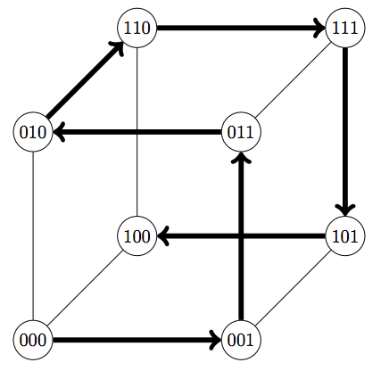

## 문제

Hypercube graphs are fascinatingly regular, hence you have devoted a lot of time studying the mathematics related to them. The vertices of a hypercube graph of dimension n are all binary strings of length n, and two vertices are connected if they differ in a single position. There are many interesting relationships between hypercube graphs and error-correcting code.

One such relationship concerns the n-bit Gray Code, which is an ordering of the binary strings of length n, defined recursively as follows. The sequence of words in the n-bit code first consists of the words of the (n − 1)-bit code, each prepended by a 0, followed by the same words in reverse order, each prepended by a 1. The 1-bit Gray Code just consists of a 0 and a 1. For example the 3-bit Gray Code is the following sequence:

000, 001, 011, 010, 110, 111, 101, 100

Now, the n-bit Gray Code forms a Hamiltonian path in the n-dimensional hypercube, i.e., a path that visits every vertex exactly once (see Figure H.1).

Figure H.1: The 3-dimensional hypercube and the Hamiltonian path corresponding to the 3-bit Gray Code.

You wonder how many vertices there are between the vertices 0n (n zeros) and 1n (n ones) on that path. Obviously it will be somewhere between 2n−1 −1 and 2n −2, since in general 0n is the first vertex, and 1n is somewhere in the second half of the path. After finding an elegant answer to this question you ask yourself whether you can generalise the answer by writing a program that can determine the number of vertices between two arbitrary vertices of the hypercube, in the path corresponding to the Gray Code.

## 입력

The input consists of a single line, containing:

* one integer n (1 ≤ n ≤ 60), the dimension of the hypercube
* two binary strings a and b, both of length n, where a appears before b in the n-bit Gray Code.

## 출력

Output the number of code words between a and b in the n-bit Gray Code.
