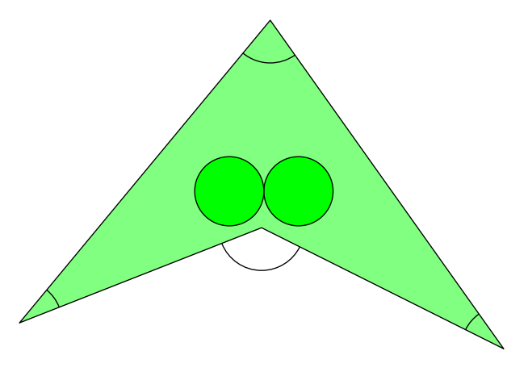

## 문제

You are about to plant a pair of fine kiwi trees inside your big property. You are worried that tree branches would grow beyond the boundaries of your property, making your neighbours complain. You must also avoid planting the two trees too close to each other so that the branches of the trees grow into each other, because that could lead to a loss of fruit.

The seller of the trees guaranteed that no branch or leaf will be farther than 4 meters from the trunk of its tree, thus we will model the trees as circles of radius 4 meters. The trunks are perfectly vertical.

Local government regulations forbid certain shapes of properties. In particular, in order for government employees to be able to draw and handle maps of the area, each property must satisfy the following properties:

1. The boundary is a simple polygon, i.e. the sides are non-intersecting and form a closed path.
2. Each side length of the property is at least 30 meters long.
3. The angle between any two consecutive sides of the property must be at least 18 degrees (10% of a straight angle), and at most 144 degrees (80% of a straight angle, or if you will, the angle of a regular decagon).

Non-convex properties are allowed as long as the angles of consecutive sides follow rule 3 above, so the inner angle at a vertex can also be between 360 − 144 = 216 and 360 − 18 = 342 degrees. See Figure K.1 for an example.

Figure K.1: Illustration of Sample Input 1 and the solution given in Sample Output 1. All the marked angles are at least 18 and at most 144 degrees.

Your property follows these rules. Can you plant two trees inside the property such that their branches and leaves do not grow beyond its boundary, and that the branches and leaves of each tree do not grow into the other tree?

## 입력

The input consists of:

* One line containing an integer n, where 3 ≤ n ≤ 2 000 is the number of vertices of the polygon describing your property.
* n lines describing one vertex each. Each such line contains two integers x and y, where 0 ≤ x, y ≤ 107 . These two numbers denote the x- and y-coordinates of a vertex in millimeters, in a clockwise order as they appear in the polygon.

Also, each polygon side is at least 30 meters (30 000 millimeters) long and the angle of two segments at a vertex is at least 18 degrees and at most 144 degrees. The polygon is nonintersecting and closed, i.e. the last vertex is connected to the first vertex.

## 출력

If it is possible to plant two trees without their branches growing beyond the boundary of your property or into each other, output two lines, each containing two real numbers x and y giving the coordinates in millimeters of two points where the trees can be planted.

Otherwise, print “impossible”.

You may assume that increasing or decreasing the radius by 1 mm will not change whether or not it is possible to plant the trees. Your answer will be accepted if the tree locations are at least 3999 mm away from the boundary and at least 2 · 3999 mm away from each other.
