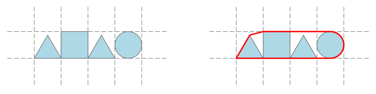

## 문제

A number of geometric shapes are neatly arranged in a rectangular grid. The shapes occupy consecutive cells in a single row with each cell containing exactly one shape. Each shape is either:

* a square perfectly aligned with the grid square,
* a circle inscribed in the grid square,
* or an equilateral triangle with a side corresponding to the bottom side of the grid square.

The shapes from the first example input and their convex contour.

Informally, the convex contour of an arrangement is the shortest line that encloses all the shapes. Formally, we can define it as the circumference of the convex hull of the union of all shapes.

Given an arrangement of shapes, find the length of its contour.

## 입력

The first line contains an integer n (1 ≤ n ≤ 20) — the number of shapes. The following line contains a string consisting of n characters that describes the shapes in the arrangement left to right. Each character is an uppercase letter “S”, “C” or “T” denoting a square, circle or a triangle respectively.

## 출력

Output a single floating point number — the length of the contour. The solution will be accepted if the absolute or the relative difference from the judges solution is less than 10−6 .
