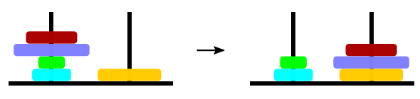

## 문제

Luka has mastered the Towers of Hanoi puzzle and has invented a somewhat similar game with disks and rods. The puzzle consists of n wooden disks of different sizes and 36 rods. The disks are numbered with integers 1 through n in the order of increasing size. The rods are organized in 6 rows numbered 1 through 6 top to bottom and 6 columns numbered 1 through 6 left to right.

An example step

The puzzle starts with all n disks stacked in arbitrary order on the rod in the upper-left corner. In each step, a player can pick up a stack of one or more disks from the top of a single rod R and transfer them (without reordering) to the top of the rod that is either immediately below R or immediately to the right of R. The goal of the game is to have all the disks stacked on the rod in the lower-right corner neatly ordered by increasing size top to bottom.

Given the initial order of the disks on the rod in the upper-left corner, find any valid sequence of steps that solves the puzzle. You may assume that a solution always exists.

## 입력

The first line contains an integer n (1 ≤ n ≤ 40 000) — the number of disks. The following line contains a sequence of n different integers d1, d2, . . . , dn (1 ≤ dk ≤ n) — the initial order of disks, bottom to top, on the rod in the upper-left corner.

## 출력

Output m lines where m is the number of steps in your solution. The k-th line should contain four tokens rk , ck , pk , nk , describing the k-th step in your solution. The tokens should be as follows:

* rk and ck are integers between 1 and 6 denoting the row number and the column number of the rod we are picking up the disks from,
* pk is an uppercase letter “D” or “R” denoting that we are transferring the disks to the rod directly below or directly to the right respectively,
* nk is a positive integer denoting the number of disks we are transferring in this step.

All steps have to be valid according to the rules above and solve the puzzle correctly.

## 힌트

In the example above, the first 9 steps simply move all the disks, without reordering, to the rod in row 6, column 5 — immediately to the left of the target rod in the lower-right corner. In the following step, the stack of five disks from the top of the rod — (6, 5, 4, 3, 2) bottom to top — are moved to the target rod. Finally, disk 1 is moved to the target rod obtaining the target bottom-to-top order (6, 5, 4, 3, 2, 1).
