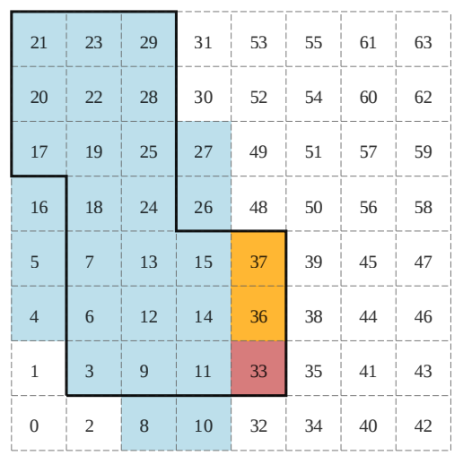

## 문제

Geohash is a procedure of coding map coordinates to scalar values for the purpose of efficient storage and querying of geographical data in databases. In this problem, a map is a 2n × 2n rectangular grid embedded in a standard coordinate system with the x coordinate growing rightwards and the y coordinate growing upwards. A map cell is a unit square aligned with the coordinate axes whose lower-left corner is a point with integer coordinates (x, y) such that 0 ≤ x, y < 2n .

There are a total of 22n cells in a 2n × 2n map. Given a map cell c, its geohash h(c) is a 2n-bit nonnegative integer constructed bit by bit starting from the most significant bit by setting the viewport to the entire map and repeating the following two steps n times:

1. We divide the viewport into two equal areas — the left half and the right half. If the cell c is in the left half, the next bit is 0, otherwise the next bit is 1. The new viewport is the area containing the cell c.
2. We divide the viewport into two equal areas — the bottom half and the top half. If the cell c is in the bottom half the next bit is 0, otherwise the next bit is 1. The new viewport is the area containing the cell c.

A geohash interval [a − b] is a set of cells whose geohash values are between a and b, both inclusive. Often, it is useful to approximate a map region with a set of geohash intervals. Given a set of cells C, and an integer t, an optimal t-approximation of C is a minimal-area region that contains C and can be described as an union of at most t geohash intervals. Formally, it is a set S of at most t geohash intervals such that:

* Each cell of C is contained in at least one interval in S.
* The total number of cells in the union of all intervals in S is minimal possible.

You are given a map region C described as a set of cells in the interior of a polygon whose sides are aligned with the grid. You are also given q target integers t1, t2, . . . , tq. For each tk find the area of an optimal tk -approximation of C.

## 입력

The first line contains an integer n (1 ≤ n ≤ 30) — the binary logarithm of the map dimensions.

The following line contains an even integer m (4 ≤ m ≤ 200) — the number of vertices of the polygon. The k-th of the following m lines contains two integers xk and yk (0 ≤ xk , yk ≤ 2n ) — the coordinates of one vertex of the polygon. The vertices are given in the counterclockwise order. Each polygon side is either vertical or horizontal. You may assume that the polygon does not intersect or touch itself, or contains consecutive parallel sides.

The following line contains an integer q (1 ≤ q ≤ 100 000) — the number of queries. The k-the of the following q lines contains a single integer tk (1 ≤ tk ≤ 109 ) — the k-th query.

## 출력

The k-th line should contain the size of the optimal tk -approximation of the given region.

## 힌트

In the example above, the intervals [3 − 29], [33 − 33] and [36 − 37] form an optimal 3-approximation of the given region. The total area of the union of the three intervals is 30.
