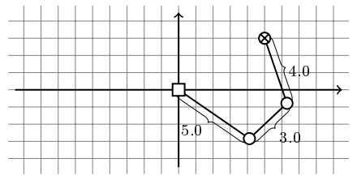

## 문제

Joao wants to jon the robotic football team of his university. However, since he knows little about robotics and mathematics, he decided to build a 2-dimensional robotic arm to bootstrap his knowledge.

The robotic arm is composed of N segments of various lengths. The segments can form any angle between them, including configurations that make it appear to self-intersect when viewed from above. The robotic arm works great, but it is not trivial to position the arm's tip as close as possible to given x, y target coordinates with so many joints to control. Can you help Joao?

Given the robotic arm description and target coordinates relative to the arm's origin, calculate a configuration that places the arm's tip as close as possible to the target.

## 입력

The first line contains N, the number of segments composing the robotic arm. N lines follow, each with an integer Li describing the length of the ith segment from the fixed point until the arm's tip. There is one more line with 2 integers: the x, y coordinates of the target point to reach.

## 출력

The output should contain N lines, each containing two real numbers xi, yi indicationg the coordinates of the tip of the ith segment.

The length of the ith segment computed from the solution and input Li may not differ by more than 0.01. Similarly, the absolute error between the solution's distance to the target and the minimum possible distance to the target cannot exceed 0.01.

Note that, in general, there are many solutions. Your program may output any of them.

## 힌트

