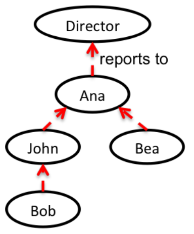

## 문제

Employee performance reviews are a necessary evil in any company. In a performance review, employees give written feedback about each other on the work done recently. This feedback is passed up to their managers which then decide promotions based on the feedback received.

Maria is in charge of the performance review system in the engineering division of a famous company. The division follows a typical structure. Each employee (except the engineering director) reports to one manager and every employee reports directly or indirectly to the director.

Having the managers assessing the performance of their direct reports has not worked very well. After thorough research, Maria came up with a new performance review system. The main idea is to complement the existing corporate structure with a technical rank for each employee. An employee should give feedback only about subordinated with lower technical level.

Hence, the performance review will work as follows. Employees prepare a summary of their work, estimate how much time it takes to review it, and then request their superiors with higher technical rank to review their work.

Maria is very proud of this new system, but she is unsure if it will be feasible in practice. She wonders how much time each employee will waste writing reviews. Can you help her out?

Given the corporate structure of the engineering division, determine how much time each employee will spend writing performance reviews.

## 입력

The first line of input has one integer E, the number of employees, who are conveniently numbered between 1 and E. The next E lines describe all the employees, starting at employee 1 until employee E. Each line contains three space-separated integers mi, ri, ti, the manager, the technical rank and the expected time to perform the review of employee i. The engineering director has no manager, represented with mi = -1. The other employees have mi between 1 and E.

## 출력

he output contains E lines. Line i has the time employee i will spend writing reviews.
