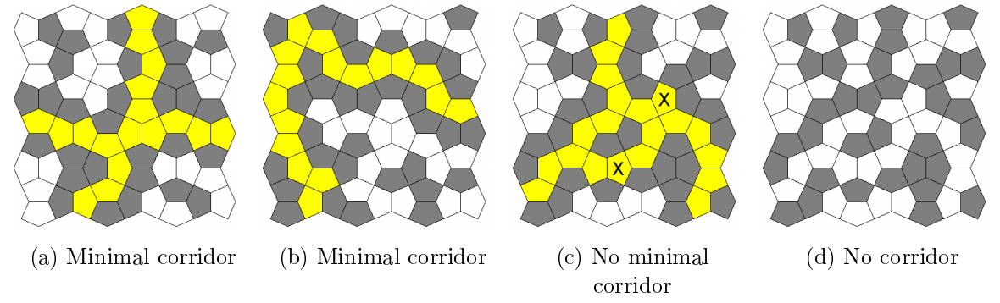

## 문제

The Cairo pentagonal tiling is a decomposition of the plane using semiregular pentagons. Its name is given because several streets in Cairo are paved using variations of this design.

Consider a bounded tilinf where each pentagon is either clear (white) or filled in (grey). A corridor is a maximal set of clear adjacent pentagons that connect the four borders of the tiling. Pentagons are considered adjacent if they share an edgr, not just a corner. It is easy to verify that there can be at most one corridor in each tiling. A corridor is said to be minimal if it has no superfluous pentagon, that is, if any pentagon of the corridor was filled in, the set of remaining pentagons would not be a corridor.

The figure above depicts four example tilings. In the first three cases, there is a corridor which is highlighted in yellow. Besides, the corridors of figures (a) and (b) are minimal, but the one in figure (c) is not: for example, the tiles marked 'X' (among others) could be filled in and a corridor would still exist. In the rightmost tiling there is no corridor.

The tilings shown in figures (a) and (c) correspond to sample input 1.

Write a program that reads textual descriptions of Cairo tilings, and for each one determines if a corridor exists and is minimal. In the latter case, the program should compute the size of the corridor, i.e., the number of clear pentagonal tiles of the corridor.

## 입력

The first line of input is a positive decimal integer T of tilings to be processed. Each tiling description k has a first line with two positive decimal integers, Nk and Mk, separated by a space. The following Nk lines contain 2 × Mk binary digits representing pairs aij, bij of tiles (0 is clear and 1 is full) in alternating horizontal/vertical adjacency following a "checkerboard" pattern, as is illustrated in the figure below.

## 출력

The output consists of T lines; the k=th line should be the size of the corridor of the k-th tiling, if there exists a minimal corridor of the k-th tiling, if there exists a minimal corridor, and NO MINIMAL CORRIDOR, otherwise.
