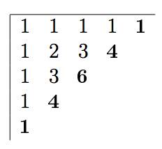
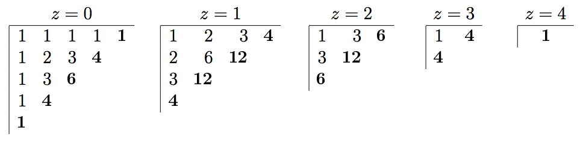

## 문제

We programmers know and love Pascal's triangle: an array of numbers with 1 at the top and whose entries are the sum of the two numbers directly above (except numbers at both ends, which are always 1). For programming this generation rule, the triangle is best represented left-aligned; then the numbers on the left column and on the top row equal 1 and every other is the sum of the numbers immediately above and to its left. The numbers highlighted in bold correspond to the base of Pascal's triangle of height 5:

Pascal's hyper-pyramids generalize the triangle to higher dimensions. In 3 dimensions, the value at position (x,y,z) is the sum of up to three other values:

* (x,y,z-1), the value immediately below it if we are not on the bottom face (z=0);
* (x,y-1,z), the value immediately behind if we are not on the back face (y=0);
* (x-1,y,z), the value immediately to the left if we are not on the leftmost face (x=0);

The following figure depicts Pascal's 2D-pyramid of height 5 as a series of plane cuts obtained by fixing the value of the z coordinate.

For example, the number at position x=1, y=2, z=1 is the sum of the values at (0,2,1), (1,1,1) and (1,2,0), namely, 6+3+3=12. The base of the pyramid corresponds to a plane of positions such that x+y+z=4 (highlighted on bold above).

The size of each layer grows quadratically with the height of the pyramid, but there are many repeated values due to symmetries: numbers at positions that are permutations of one another must be equal. For example, the numbers at positions (0,1,2), (1,2,0) and (2,1,0) above are all equal to 3.

Write a program that, given the number of dimensions D of the hyper-space and the height H of a hyper-pyramid, computes the set of numbers at the base.

## 입력

A single line with two positive integers: the number of dimensions, D, and the height of the hyper-pyramid, H.

## 출력

The set of numbers at the base of the hyper-pyramid, with no repetitions, one number per line, and in ascending order.
