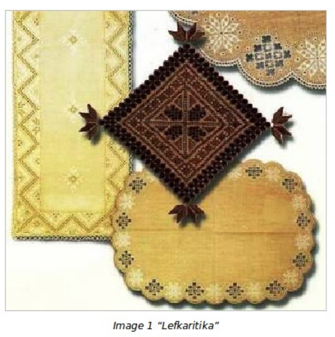
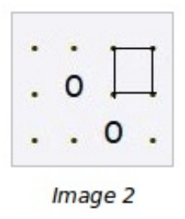
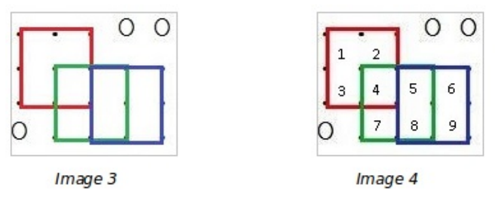

## 문제

"Lefkaritika" are traditional hand-made lace designs, a characteristic type of embroidery art in Cyprus. The tradition of lace-making in the village of Lefkara dates back to the fourteenth century. Influenced by indigenous craft, the embroidery of Venetian courtiers who ruled the island in 1489, and ancient Greek and Byzantine geometric patterns, Lefkara lace is made by hand in designs combining four basic elements: the hemstitch, cut work, satin stitch fillings and needlepoint edgings.

This combined art and social practice is still the primary occupation of women in the village who create distinctive tablecloths, napkins and show pieces while sitting together and talking in the narrow streets or on covered patios. Unique mastery of the craft is passed to young girls through years of informal exposure and then formal instruction by their mother or grandmother in applying cotton thread to linen.

When she has learned her art thoroughly, the lace-maker uses her imagination to design work that embodies both tradition and her own personality. Testament to the ability to appreciate multiple influences and incorporate them into one’s own culture, lace-making is at the center of daily life for women of Lefkara and a proud symbol of their identity.

"Lefkaritika" were inscribed on the Representative List of Intangible Cultural Heritage of Humanity in 2009. They are included in the Heritage Archives of the Municipality of Lefkara and in the Archives of Oral Tradition of the Scientific Research Centre of Cyprus as well as at the National Heritage Index.

Pantelis owns a smallsouvenir shop in the village of Lefkara. He has inherited a large collection of square size “Lefkaritika” from his grandmother and he wants to store them in the shop’s storeroom. The problem is that the storeroom is not large enough so he will have to place some items on top of others. He wants to know the maximum number of "Lefkaritika" he can fit on the storeroom floor with the following rules:

* Items are square and come in all integer side lengths.
* Larger items must be placed first. The largest item can cover the entire room if possible. Smallest items are of size 1 x 1.
* No item can be placed directly under a light bulb, otherwise the lace will be damaged.
* No item can cover another item of the exact same size completely, but otherwise items can overlap. Smaller Items of different size can be placed on top of larger items and cover them completely.
* The top left corner of every item should be placed at integer coordinates and the item must fit completely in the storeroom.
* The sides of the item must be parallel to the axes.

Consider the following pattern representing the storeroom floor as a 3 x 4 grid, where “O” represents a light bulb hanging from above, and “.” represents available space:

We can place only one 1 x 1 item in the upper right corner as you can see in image 2 above. No other item can be placed due to the placement of the lamps.

## 입력

* The first line consists of two space-separated integers W and L, the width and length of the storeroom floor
* The second line consists of one integer B, the number of light bulbs
* The next B lines consist of two space-separated integers, xi and yi, the coordinates of the ith light bulb

## 출력

The output consists of a single line containing a single number, the maximum number of items that can be placed in the storeroom. This number may be larger than what can be represented by a 32-bit integer.

## 힌트

Three 2 x 2 items can be placed as in image 3 below. Another nine 1 x 1 items can be placed on top of the 2 x 2 items, but not on top of another 1 x 1 item, as in image 4 below, for a total of twelve items.

