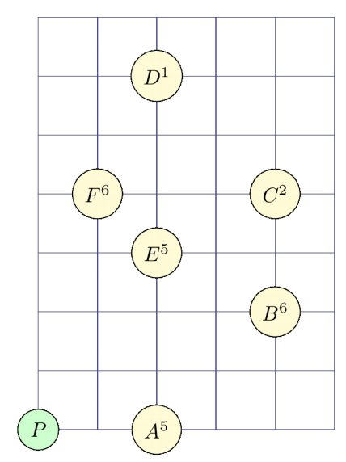

## 문제

A group of computer science students arrive in Athens for summer vacation. While thinking of fun ways to explore the Aegean sea by sailing, they came up with the following game:

* Each island is assigned a number of points.
* The cruise starts and ends at the port of Piraeus, whose coordinates are assumed to be (0, 0). All islands are located strictly to the east of Piraeus.
* The sailing course can only be straight from one island to another (or Piraeus). It can pass at most once through any given point of the Aegean sea (except Piraeus).
* If an island is visited or if it is located inside the area covered by the sailing team, then the team collects the points assigned to that island.
* The goal is to maximize the ratio R of collected points over the total distance of the cruise.

Your task is the following: given the coordinates of each island and the assigned points, find the ratio R of the optimal route for the sailing cruise.

Let us assume that there are six islands, named A through F, located as shown in the following figure. For example, the coordinates of island B are (4, 2) and its associated points are 6.

The following three figures show three possible sailing routes, starting from Piraeus and returning there. Below each figure is the corresponding ratio R. Among these three, the leftmost route has the highest ratio R of collected points over total distance. Notice that in the rightmost route, the sailing team collects the points of island E - which is located inside the area covered by the cruise.

|  |  |  |
| --- | --- | --- |
|  |  |  |
| $R = \frac{5+6+2}{2+\sqrt{8}+2+\sqrt{32}} \simeq 1.041226$ | $R = \frac{2+5+6}{\sqrt{32}+\sqrt{5}+\sqrt{2}+\sqrt{17}} \simeq 0.967965$ | $R = \frac{2+5+6}{\sqrt{32}+3+\sqrt{17}} \simeq 1.017218$ |

Also, notice that the routes P, B, E, C, F, E, P and P, B, F, C, P are not legal, because then the team would pass twice through the same point (island E and the intersection of BF and CP, respectively).

## 입력

The first line of the input will contain a positive integer N: the number of islands. Each of the following N lines will contain three integer numbers Xi, Yi, Pi: the coordinates (Xi, Yi) of the i-th island and the assigned points Pi. There will not be two islands with the same coordinates.

## 출력

The output will contain a single line with a single real number: the ratio of the optimalsailing route. The number that you will print must not differ from the actual optimal ratio by more than 10-6.
