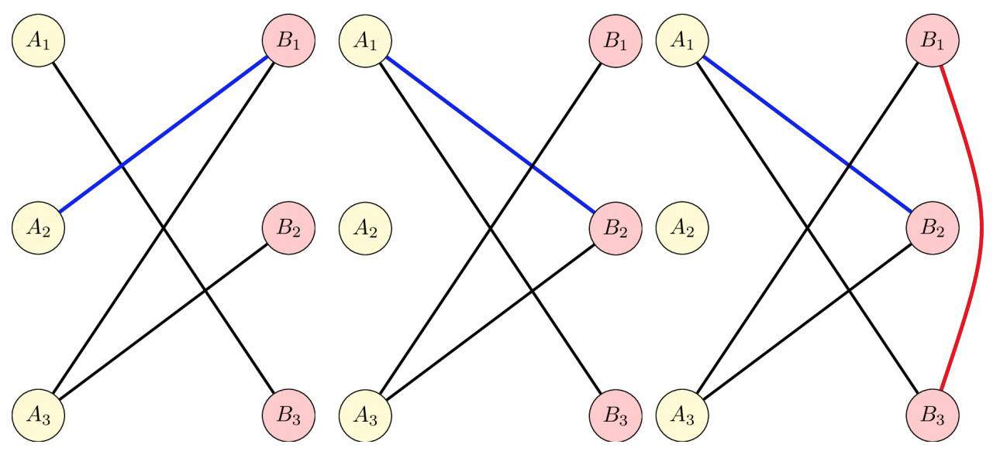

## 문제

An acrobat wants to make her last and greatest performance, so that she is forever remembered. She will perform a tightrope walking act, unlike anything that has been done before. Tightrope walking is the art of walking along a thin wire or rope while maintaining one’s balance.

To make it a breath-taking experience, each rope she will be walking on will be hanging over a deep canyon formed between two neighboring hills. In fact, an even more original aspect of her act will be that the endpoints of the ropes will not be nailed on the hilltops, but rather held by trained assistants standing on each hill. Specifically, assistants A1, A2, ..., An will be standing on the first hill, in this order, and B1, B2, ..., Bn will be standing on the second hill, each one of them standing opposite to the respective assistant on the first hill. This means that for each i, Ai is standing across the canyon opposite to Bi. Also, each rope is held between exactly two people standing in different hills, say Ai and Bj. As the ropes are really tight, after the acrobat moves across a rope and gets to the other side, it snaps, so she cannot use it again.

The acrobat wants to start at a rope’s end on the first hill, walk on every rope exactly once (remember, ropes are destroyed after their use) and continue in this way untilshe returns to the point where she started and all ropes have been destroyed. After walking on a rope and reaching its end, she wants to start walking on another rope that is held by the assistant that is located there.

However, her assistants have already taken their places and are holding the ropes in the way they wanted, without asking her for directions. Depending on the initial positions of the ropes, the acrobat sees that it may not be possible to perform her act as she planned. Fortunately, she can make two types of changes:

* 1: Given a rope between Ai and Bj, she can tell these two assistants to simultaneously throw their end of the rope to the assistant standing opposite to them, so after this the rope will be held between Bi and Aj.
* 2: On the second hill (which is far from her audience and she won’t be noticed) she can walk between the positions of any pair of assistants Bi and Bj.

Your task is to check if it is possible for the acrobat to perform her act with a relatively small number of such changes and, if so, find the changes that need to be made.

## 입력

In the first line of the input there will be two numbers N and M: N is the number of assistants on each hill and M is the number of ropes that the assistants initially hold. Each of the following M rows will contain two integers i and j, separated with a space, denoting that a rope is held by assistants Ai and Bj. Initially, there will not be two different ropes held by the same pair of assistants. (However, note that this could be true after applying changes of type-1.)

## 출력

The first line of the output there should contain a single integer number. If the requirements cannot be met no matter how many changes are applied, this number should be −1. Otherwise, it should be equal to the number of changes that should be made.

In case the first line of the output contains a positive integer K, each of the following K lines should contain one change that should be applied. If a type-1 change is required (i.e., assistants Ai and Bj to simultaneously throw their end of the rope to the assistant standing opposite to them), then the corresponding line should contain “1 i j”. This change is valid only if there exists initially a rope between Ai and Bj. If a type-2 change is required (i.e., walk the path between assistants Bi and Bj), then the corresponding line should contain “2 i j”.

## 힌트

In this example, the initial configuration of the ropes is shown in the left figure. After the first change, the blue rope has changed position (middle figure). After the second change, the red “walk path” has been introduced (right figure). It is now possible for the acrobat to perform her act by walking as follows: A1, B3, B1, A3, B2, A1. She has returned where she has started and all the ropes have been destroyed.
