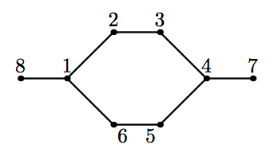
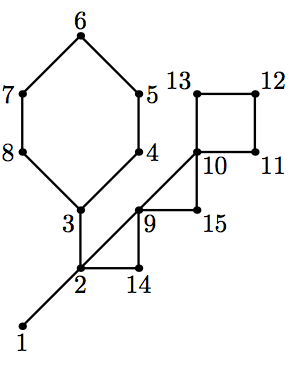
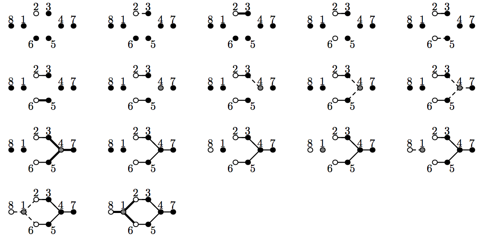

## 문제

Let us consider the following way of constructing graphs. Pick the number of colors ˆc. Let n be the number of vertices in a graph. To build a graph, we use a workspace with several graphs in it. Each vertex of each graph has a color. Colors are denoted by integers from 1 to ˆc. Initially, we have n graphs in a workspace with one vertex in each graph, all colored with color 1, and no edges. The only vertex of i-th graph has number i.

The following operations are permitted:

* join a b: join graphs containing vertices a and b into one graph. No edges are added. Vertices a and b must be in different graphs.
* recolor a c1 c2: in graph containing vertex a recolor all vertices of color c1 with color c2.
* connect a c1 c2: in graph containing vertex a create edges between all pairs of vertices where one vertex has color c1 and the other has color c2. If c1 = c2 loops are not created. If such an edge already exists, then the second parallel edge is created. Multi-edges are not allowed in this problem, so this case must not occur.

At the end we should have a single graph and colors of its vertices do not matter.

The minimal number of colors ˆc, that can be used to construct a graph, is called a clique width of a graph. Clique width is one of the characteristics of graph complexity. Many NP-hard problems can be solved in polynomial time on graphs with bounded clique width, using dynamic programming on this process of building a graph. For a general graph, calculating the exact value of a clique width is known to be NP-hard. However, for some graph classes bounds on a clique width are known.

Cactus is a connected undirected graph in which every edge lies on at most one simple cycle. Intuitively cactus is a generalization of a tree where some cycles are allowed. Multi-edges (multiple edges between a pair of vertices) and loops (edges that connect a vertex to itself) are not allowed in a cactus. It is known that a clique width of a cactus does not exceed 4.

You are given a cactus. Find out how to build it in the described way using at most ˆc = 4 colors.

## 입력

The first line of the input file contains two integers n and m (1 ≤ n ≤ 50 000; 0 ≤ m ≤ 50 000). Here n is the number of vertices in the graph. Vertices are numbered from 1 to n. Edges of the graph are represented by a set of edge-distinct paths, where m is the number of such paths.

Each of the following m lines contains a path in the graph. A path starts with an integer ki (2 ≤ ki ≤ 1000) followed by ki integers from 1 to n. These ki integers represent vertices of a path. Adjacent vertices in the path are distinct. The path can go to the same vertex multiple times, but every edge is traversed exactly once in the whole input file.

The graph in the input file is a cactus.

## 출력

In the first line print one integer q — the number of operations you need. This number should not be greater than 106 . In the next q lines print operations. Each operation is denoted by its first letter (“j” for join, “r” for recolor and “c” for connect) and its arguments in the order they are described in the problem statement.

At the end, after applying all these operations, one should have one graph, which is equal to the cactus in the input. This means that there should be exactly one edge between each pair of vertices connected in the input graph, and no edges between vertices not connected in the input graph.

## 힌트

The following picture visualizes the sequence 17 operations from the first sample output. If an edge is not created yet, but its vertices are already in one graph, then this edge is drawn as dashed.

