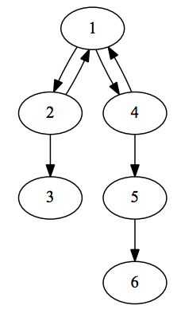

## 문제

Gennady and Georgiy are playing interesting game on a directed graph. The graph has n vertices and m arcs, loops are allowed. Gennady and Georgiy have a token placed in one of the graph vertices. Players take turns moving the token along one of the arcs that starts in the vertex the token is currently in. When there is no such arc, then this player loses the game.

For each initial position of the token and the player who is moving first, your task is to determine what kind of result the game is going to have. Does it seem to be easy? Not so much.

On one side, Gennady is having a lot of fun playing this game, so he wants to play as long as possible. He even prefers a strategy that leads to infinite game to a strategy that makes him a winner. But if he cannot make the game infinite, then he obviously prefers winning to losing.

On the other side, Georgiy has a lot of other work, so he does not want to play the game infinitely. Georgiy wants to win the game, but if he cannot win, then he prefers losing game to making it infinite.

Both players are playing optimally. Both players know preferences of the other player.

## 입력

In the first line there are two integers — the number of vertices n (1 ≤ n ≤ 100 000) and the number of arcs m (1 ≤ m ≤ 200 000). In the next m lines there are two integers a and b on each line, denoting an arc from vertex a to vertex b. Vertices are numbered from 1 to n. Each (a, b) tuple appears at most once.

## 출력

In the first line print n characters — i-th character should denote the result of the game if Gennady starts in vertex i. In the second line print n characters — i-th character should denote the result of the game if Georgiy starts in vertex i. The result of the game is denoted by “W” if the starting player wins the game, “L” if the starting player loses the game, and “D” (draw) if the game runs infinitely.

## 힌트

In vertices 3 and 6 the game is already lost. In vertex 5, the only move is to vertex 6, and the player wins. If Georgiy starts in vertex 1, or Gennady in vertices 2 or 4, Gennady can always go to vertex 1, and make the game infinite. If Georgiy starts in vertex 4, he can either go to vertex 1 (which leads to a draw) or to vertex 5, which leads to losing. Georgiy prefers the latter. Similarly, from vertex 2, he prefers to go to 3 and win. From vertex 1, Gennady can go to vertex 2 and lose, or go to vertex 4 and win. He prefers the latter.
