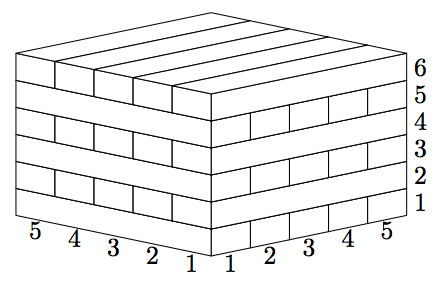
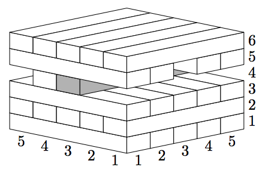

## 문제

Jane is a game designer and she designs the next version of Jenga Boom, where the blocks have dimensions of 1×w ×wn instead of the ordinary 1×2×6. As usual, the initial tower is created at the game start. It consists of the blocks in levels of n blocks placed next to each other along their long sides and at a right angle to the previous level. Players remove blocks from the tower in turns, until the tower collapses.

  
Initial tower

  
The tower before collapse

Jane wants to build a game simulator that helps her to decide the best n and w. The simulator shall compute the moment when the tower collapses if blocks are removed in the specified order. Tower collapses if there is a cross-section between levels such that the center of the mass of the levels above it does not belong to or is at the edge of the convex hull of the previous level projection.

## 입력

The first line contains two integers n and w that define the dimensions of the block as described in the problem statement (1 ≤ n, w ≤ 10 000). The second line also contains two integers: h — the number of levels in the tower and m — the number of removed blocks (1 ≤ h, m ≤ 5 000).

The next m lines contain coordinates of the removed blocks with two integers each: li — the level of the block, counting from the bottom and ki — the position of the block, counting from the edge nearest to the players (1 ≤ li ≤ h; 1 ≤ ki ≤ n). Blocks are removed one by one and no block is removed twice.

## 출력

In the first line output “yes” if the tower collapses, and “no” otherwise. In the former case, output the number of the block (starting from 1), that was removed just before the collapse, in the next line.
