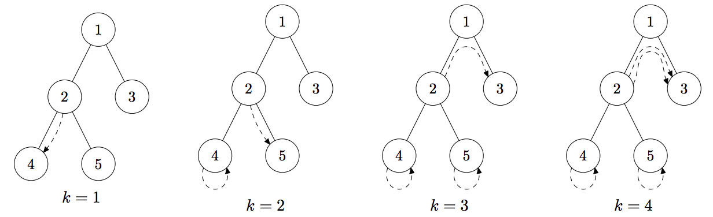

## 문제

Moles create tunnels for traveling between their holes. In this problem we investigate one tunnel system that was built by moles. It consists of n holes and n − 1 tunnels connecting them. Let us number all holes from 1 to n. Then for all i > 1, a hole number i is connected by a tunnel to the hole number ⌊ i /2 ⌋. Tunnels are bidirectional. For each hole i we know the amount of food ci in that hole. It means that there is enough food for exactly ci moles in that hole.

There are m moles living in the tunnel system. For each mole i you are given an integer pi — the hole number where the mole i is currently sleeping. In the morning, the first k moles wake up and want to eat, while m − k others are sleeping. Each of k woken up moles chooses some hole and crawls to it. They are quite smart, so they want to minimize the total distance traveled. The distance traveled by one mole is the total number of tunnels which it uses to get from one hole to another. The first k moles who woke up want to move in such a way, so that there is enough food for them at the holes they choose to crawl to. It means that in the hole i there are no more than ci woken up moles after all their movements are done.

You must find the minimum total distance for all k from 1 to m. It is guaranteed that there always exists a way for all moles to eat.

## 입력

The first line contains two integers n and m (1 ≤ n, m ≤ 105 ) — the number of holes and moles. The second line contains n integers ci (0 ≤ ci ≤ m) — the amount of food in the hole i. The third line contains m integers pi (1 ≤ pi ≤ n) — the starting positions of the moles.

## 출력

You must print m numbers. The k-th number is the minimum total distance the first k moles need to travel if they woke up first.

## 힌트

Dashed arrows in the above pictures show possible travel of woken up moles that minimizes the total distance. For example, for k = 2 the first mole goes from the hole 2 to the hole 5 and the second mole stays in the hole 4.
