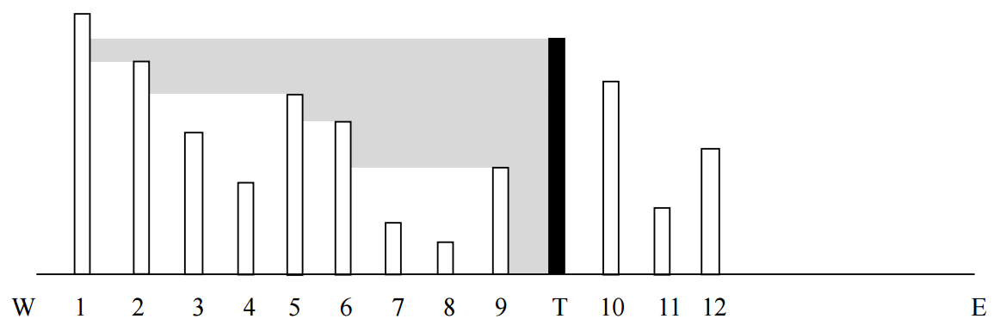
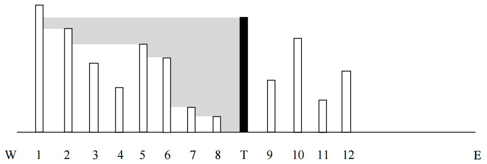

## 문제

City X consists of N buildings, ordered in a row from west to east and numbered from 1 to N. Each building has a different height – an integer number, respectively h1, h2, …, hN. The city government plans to build a tower, which will be in the same row as the buildings (it can be before the first building, between any two of the buildings or after the last building). The tower will broadcast messages to the citizens. The tower must have height H, which should be different from all other buildings’ heights.

Due to some strange engineering ideas, the tower will be able to broadcast signals only to the west (to the beginning of the buildings’ row). The signals are also strange – they are rays which travel horizontally (parallel to the ground, which we consider as a straight line) and are emitted out of the whole body of the tower (from the top to the bottom). Therefore, we can imagine that the tower radiates a continuous band of signals with width equal to the tower’s height. When a ray hits a building, it stops. Each building receives the signals using a receiver located on its top. A building receives a message if at least one ray reaches its receiver.

In other words, a building numbered i will receive messages from the tower only when: the building i is to the west of the tower; i is not higher than the tower; and there is no other building j between them (j > i), which is higher than building i.

Look at the example in the figure above: the buildings, which are able to receive messages, are with numbers 2, 5, 6, and 9.

Write a program tower to determine the maximum number of buildings, which would receive messages. You will be given the row of buildings in the town (actually, their heights) and the height of the tower. Certainly, you have to consider the optimal placement for the tower.

## 입력

Two, space separated, positive integers are given on the first row of the standard input: N and H – the number of buildings and the height of the tower.

N, space separated, positive integers are input from the second row – the heights of the buildings in the town, ordered by the building numbers (from the first to the N-th)

## 출력

On a single row of the standard output print a single integer – the maximal number of buildings, which would receive messages, if the tower were built, assuming optimal placement.

## 힌트

Explanation: On the picture below, the optimal location of the tower is given. Messages are received by buildings with numbers 2, 5, 6, 7 and 8.

