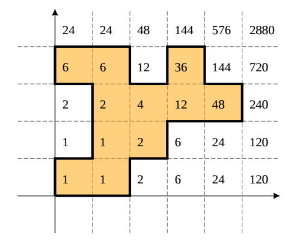

## 문제

Pašnjak na kojem uspijevaju faktorijeli smješten je u standardni koordinatni sustav u kojem x koordinata raste nadesno, a y koordinata prema gore. Polje je kvadrat duljine stranice jedan, sa stranicama paralelnim s koordinatnim osima, takav da su koordinate njegovog donjeg lijevog vrha A = (xA, yA) oba nenegativni cijeli brojevi. Vrijednost svakog takvog polja je broj xA!yA!, gdje je a! = 1 × 2 × . . . × a za a ≥ 1, dok je 0! = 1.

Ograda je poligon sa stranicama paralelnim s koordinatnim osima. Za zadanu ogradu izračunajte zbroj vrijednosti svih polja unutar ograde modulo 109 + 7.

## 입력

U prvom redu nalazi se prirodni broj n (n ≤ 100) — broj vrhova ograde. U k-tom od sljedećih n redova nalaze se cijeli brojevi xk i yk (0 ≤ xk , yk ≤ 109 ) — koordinate k-tog po redu vrha ograde. Možete pretpostaviti da vrhovi čine poligon čije su stranice paralelne s koordinatnim osima. Izmedu ostalog, poligon ne siječe samog sebe te dvije susjedne stranice nikada nisu paralelne.

## 출력

U prvi red ispišite traženi zbroj modulo 109 + 7.

## 힌트

