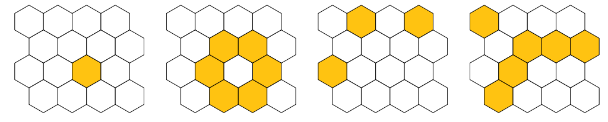

## 문제

Pčele svakog dana pohranjuju med u saće – mrežu voštanih ćelija koja se sastoji od pravilnih šesterokuta organiziranih u retke i stupce. Tijekom noći, ličinke pojedu sav med iz saća tako da je na početku svakog dana saće potpuno prazno. Malo je poznata činjenica da pčele ne pohranjuju med u nasumične ćelije, budući da raspored ovisi izravno o tome koje su ćelije sadržavale med prethodnog dana. Celija će, naime, sadržavati med ako i samo ako je broj susjednih ćelija (ne uključujući i promatranu ćeliju) koje su sadržavale med prethodnog dana bio neparan. U suprotnom će ćelija biti prazna.

  
Ilustracija prvog primjera test podataka

## 입력

U prvom se redu nalaze tri prirodna broja, n, m i k (2 ≤ n, m ≤ 10, 1 ≤ k ≤ 263 − 1), redom broj redaka i stupaca saća te broj dana.

U idućih se n redaka nalazi po m znakova ’#’ (ljestve) i ’.’ (točka) koji označuju ima li (ljestve) ili nema (točka) meda u danoj ćeliji saća na početku. Saće je uvijek zadano tako da je prva ćelija prvog retka “gore lijevo” od prve ćelije drugog retka, kao na slici u tekstu zadatka.

## 출력

Potrebno je ispisati stanje saća nakon k dana u istom formatu u kojem je saće zadano na ulazu.
