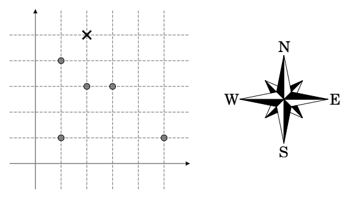

## 문제

Olujno nevrijeme razbacalo je roj pčela po koordinatnoj ravnini te se svaka pčela trenutno nalazi u nekoj točki s cjelobrojnim koordinatama. Sve pčele žele se naći u istoj točki, takoder sa cjelobrojnimkoordinatama. Pčele iz ovog roja dijele genetsku mutaciju zbog koje mogu letjeti samo u odredenimsmjerovima. Dozvoljeni smjerovi su podskup skupa svih glavnih i sporednih strana svijeta. Kao i obično, sjever je smjer rastuće y koordinate dok je istok smjer rastuće x koordinate.

U svakom koraku, jedna pčela može se pomaknuti na susjednu točku sa cjelobrojnim koordinatama u jednom od dozvoljenih smjerova. Pronadite najmanji ukupan broj koraka potreban da se sve pčelenadu u istoj točki.

  
Ilustracija prvog primjera test podataka

## 입력

U prvom redu nalazi se cijeli broj d (1 ≤ d ≤ 8) — broj dozvoljenih smjerova. Drugi red sadrži d različitih nizova znakova odvojenih s po jednim razmakom. Svaki niz znakova je jedan od N, NW, W, SW, S, SE, E, NE koji redom označavaju sjever, sjeverozapad, zapad, jugozapad, jug, jugoistok, istok i sjeveroistok.

U sljedećem redu nalazi se prirodni broj n (1 ≤ n ≤ 50) — broj pčela. U k-tom od sljedećih n redova nalaze se cijeli brojevi xk i yk (−106 ≤ xk , yk ≤ 106 ) — koordinate točke u kojoj se trenutno nalazi k-ta pčela. Možete pretpostaviti da se sve pčele nalaze u različitim točkama.

## 출력

Ispišite traženi najmanji ukupan broj koraka. Možete pretpostaviti da rješenje uvijek postoji.
