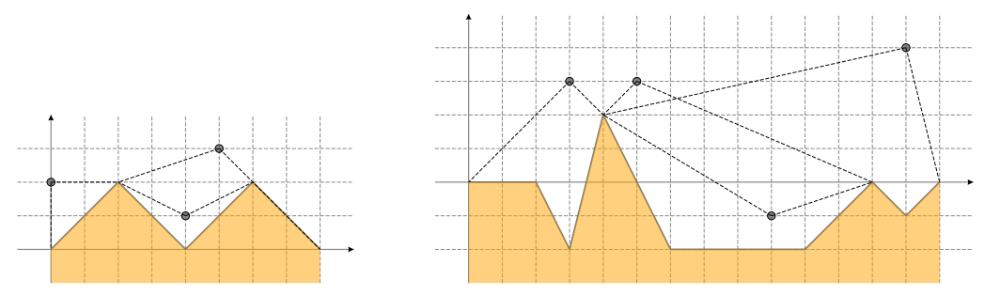

## 문제

Pod rudarske špilje zamišljamo kao izlomljenu liniju u koordinatnom sustavu koja se sastoji od n + 1 vrhova (x0, y0), (x1, y1), . . . , (xn, yn) te n dužina koje povezuju uzastopne vrhove. Pod počinje u ishodištu, proteže se slijeva nadesno te završava na x-osi (0 = x0 < x1 < . . . < xn, y0 = yn = 0). Dužina koja povezuje vrh (xi−1 , yi−1) sa vrhom (xi , yi) je opisana sa dva cijela broja di i ki — redom duljinom projekcije dužine na x-os te koeficijentom smjera pravca odredenog dužinom. Dakle, točka (xi , yi) je jednaka (xi−1 + di , yi−1 + kidi).

  
Ilustracije primjera test podataka

Rudari mogu objesiti lampu u bilo koju točku A iznad poda špilje. Kažemo da lampa osvjetljava točku B na podu špilje ako dužina AB ne siječe pod špilje (dozvoljeno je da dužina AB dodiruje pod špilje u točkama ili uzduž segmenata). Jasno je da lampa osvjetljava točku A 0 koja se nalazi na podu špilje neposredno ispod A. Glavni interval lampe u točki A je područje poda špilje do kojeg rudari mogu doći šetnjom po podu špilje počevši iz točke A 0 , a da cijelo vrijeme budu osvijetljeni lampom u točki A.

Zadano je q mogućih pozicija lampe. Za svaku poziciju odredite lijevi i desni rub glavnog intervala lampe na toj poziciji.

## 입력

U prvom redu nalaze se prirodni brojevi n i q (1 ≤ n, q ≤ 100 000) — broj segmenata od kojih se sastoji pod špilje te broj mogućih pozicija lampe.

U i-tom od sljedećih n redova nalaze se dva cijela broja di i ki (1 ≤ di ≤ 109 , −109 ≤ ki ≤ 109 ) — duljina projekcije i koeficijent smjera i-tog segmenta. Možete pretpostaviti da su parametri takvi da za vrhove poda špilje vrijedi 0 = x0 < x1 < . . . < xn ≤ 109 , y0 = yn = 0, −109 ≤ yi ≤ 109 .

U i-tom od sljedećih q redova nalaze se dva cijela broja x'i , y'i (0 ≤ x'i ≤ xn, −109 ≤ y'i ≤ 109) — koordinate i-te potencijalne pozicije. Sve pozicije se nalaze strogo iznad poda špilje.

## 출력

Ispišite q redova. U i-ti red ispišite dva cijela broja — redom x-koordinate lijevog i desnog ruba glavnog intervala lampe u i-toj potencijalnoj poziciji. Možete pretpostaviti da su tražene koordinate uvijek cijeli brojevi.
