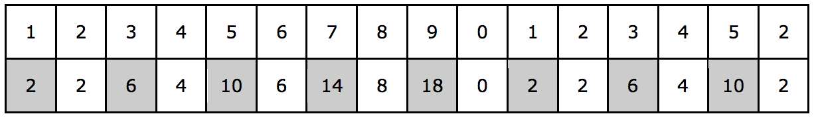
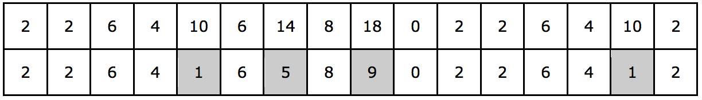

## 문제

Većina bankovnih kartica ima šesnaesteroznamenkasti broj koji zovemo broj kartice. Međutim, nije bilo koji broj ispravan broj kartice - taj broj mora zadovoljavati Luhnov algoritam. Luhnov algoritam funkcionira na slijedeći način:

1. Počevši od zadnje znamenke, svaka druga znamenka se udvostruči.
2. Ako je rezultat udvostručenja znamenke veći ili jednak 10, dobivenom umnošku se zbroje znamenke da se dobije jednoznamenkasti broj.
3. Svi brojevi se zbroje.
4. Dobiveni zbroj mora biti dijeljiv s 10.

Na primjer, ako je broj kartice 1234567890123452, udvostručenjem svake druge znamenke dobili bismo:

Kada svakom broju većem ili jednakom 10 zbroje znamenke, dobijemo:

Kada se tako dobiveni brojevi zbroje, ukupan rezultat je 60, što je djeljivo s 10 pa je i kartica valjana.

Vaš zadatak je provjeriti je li dana kartica valjana.

## 입력

U prvom i jedinom retku ulaznih podataka nalazi se jedan cijeli broj: šenaesteroznamenkasti broj koji označava broj kartice.

## 출력

Potrebno je ispisati "DA" ako je dani broj valjani broj kartice, odnosno "NE" ako to nije.
