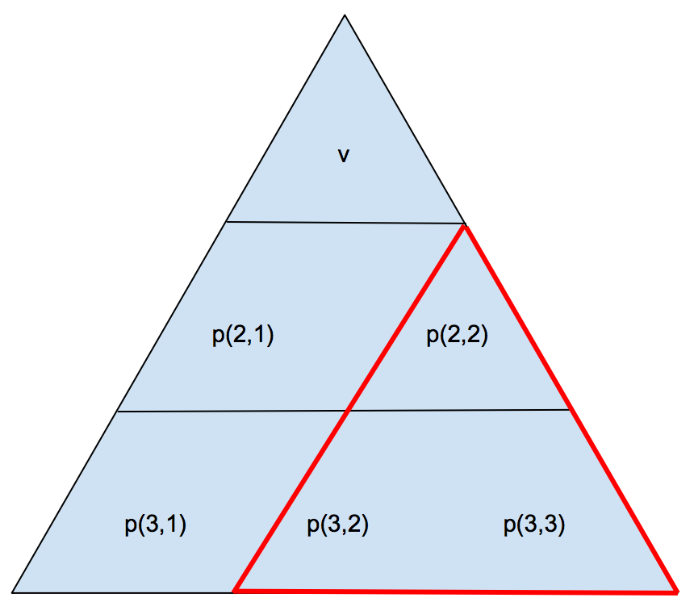

## 문제

Mirko i Slavko su svoje ljetne praznike odlučili provesti u pustinji, lutajući naokolo u potrazi za zanimljivostima. Tako su jednog dana naletjeli na piramidu. Na vratima piramide oni su uočili malenu konzolu na kojoj je ispisana zagonetka. Da bi mogli ući u piramidu, oni je moraju riješiti. Cijela zagonetka sastoji se od samo 6 cijelih brojeva: n, v, a, b, c, m. Slavko je odmah otvorio svoj pustinjski priručnik na poglavlju o piramidskim zagonetkama gdje je ugledao sljedeću sliku:

Dodatno, ispod slike su bila napisana sljedeća tri matematička izraza:

1. p(1,1)=v
2. p(i,1)=(c⋅p(i-1,1)) mod m, za 2 ≤ i ≤ n
3. p(i,j)=(a⋅p(i,j-1)+b⋅p(i-1,j-1)) mod m, za 2 ≤ i ≤ n i 2 ≤ j ≤ i.

Mirku i Slavku je odmah bilo jasno da formule opisuju način konstruiranja piramide proizvoljne veličine n, oblikom nalik na onu prikazanu slikom. Njih dvojica su odmah konstruirali piramidu i utipkali je u konzolu, rješivši time zagonetku. Međutim, njihovoj muci nije kraj. Nakon ispisane čestitke, na konzoli se pojavio broj q. Nakon njega slijedi q redaka od kojih svaki sadrži tri broja: r, s i x. U pustinjskom priručniku naši junaci su našli da ti brojevi predstavljaju neku pod-piramidu sa vrhom na koordinati (r,s) i stranicom duljine x. Npr. r=2, s=2 i x=2 predstavljaju crvenu pod-piramidu sa slike. U priručniku također piše da se tradicionalno na takve upite odgovara s maksimalnim brojem od svih onih koji su sadržani u pod-piramidi.

## 입력

Prvi redak ulaza sadrži točno šest brojeva: n, v, a, b, c, m, uz ograničenja: 1 ≤ n ≤ 4000, 1 ≤ v ≤ 109 , 1 ≤ a ≤ 109 , 1 ≤ b ≤ 109 , 1 ≤ c ≤ 109 i 2 ≤ m ≤ 109 .

Sljedeći redak sadrži broj q, 1 ≤ q ≤ 5⋅105 .

Nakon toga slijedi q redaka, svaki sa tri broja r, s, x uz ograničenja: 1 ≤ r ≤ n, 1 ≤ s ≤ r i 1 ≤ x ≤ n-r+1.

## 출력

Izlaz treba sadržavati točno q redaka. Oni predstavljaju maksimalne brojeve u zadanim podpiramidama.
