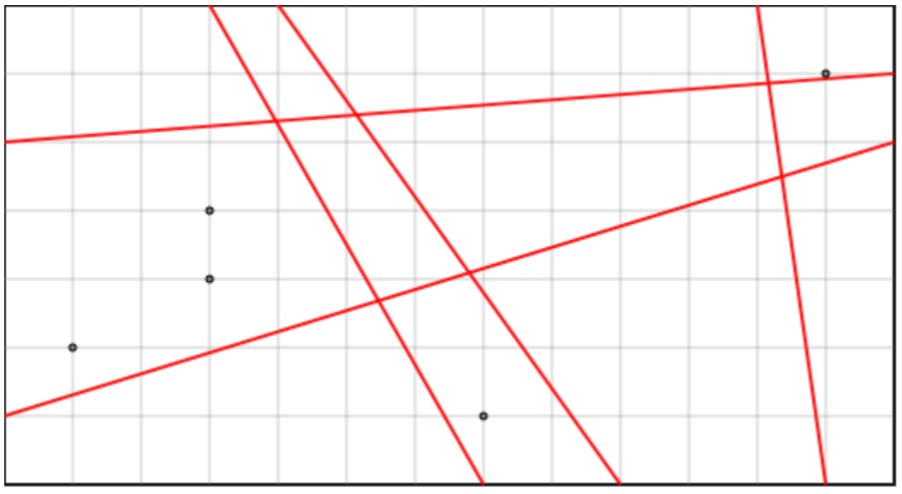

## 문제

Mirko ima dvodimenzionalni sir širine S i visine V. Na tom siru on napravi A rezova tipa "A" koji sijeku i lijevi i desni rub sira. Nakon toga on napravi B rezova tipa "B" koji sijeku i gornji i donji rub sira. Rezovi istog tipa se nikada ne sijeku. Unutar sira postoji N ljutih papričica koje su zadane svojim x, y koordinatama. Nakon što je Mirko narezao sir, zanima ga koliko papričica ima u najljućem komadu sira. Pomozite Mirku!

## 입력

U prvom retku nalaze se brojevi 1 ≤ S ≤ 107 i 1 ≤ V ≤ 107 , koji predstavljaju širinu i visinu sira. Drugi redak sadrži broj papričica N, 1 ≤ N ≤ 100 000. Nakon toga slijedi N redaka. Svaki redak sadrži dva cijela broja 0 < x < S i 0 < y < V. Ti brojevi predstavljaju koordinate papričica. Nijedna papričica neće ležati ni na jednom rezu. Dvije papričice neće ležati na istim koordinatama.

Redak nakon toga sadrži cijeli broj 1 ≤ A ≤ 100 000, broj rezova koji sijeku i lijevi i desni rub. Sljedećih A redaka sadrži po dva cijela broja 0 < ylijevo,ydesno < V, y-koordinate sjecišta reza sa lijevom i desnom stranom sira. Redak nakon slijedi cijeli broj 1 ≤ B ≤ 100 000. U sljedećih B redova nalaze se po dva cijela broja 0 < xgore,xdolje < S koja predstavljaju x-koordinate sjecišta sa gornjom i donjom stranicom sira.

Niti jedna dva reza koja sijeku lijevi i desni rub se neće međusobno sjeći niti dodirivati.

Niti jedna dva reza koja sijeku gornji i donji rub se neće međusobno sjeći niti dodirivati.

Koordinate su opisane u standardnom Kartezijevom koordinatnom sustavu. To znači da x raste slijeva na desno, a y raste odozdo prema gore.

## 출력

Na izlazu je potrebno ispisati jedan jedini broj koji je jednak broju papričica u četverokutu koji ih sadrži najviše.
