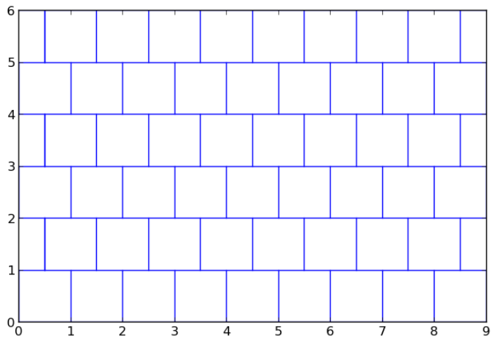
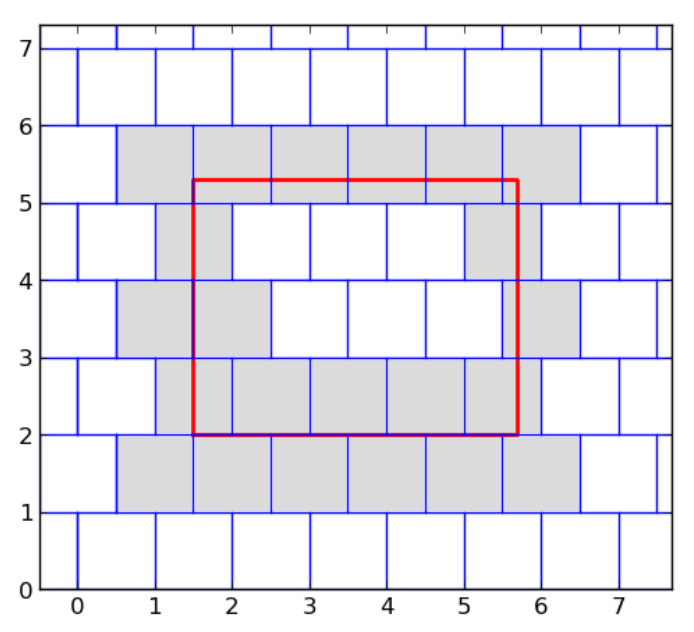

## 문제

Mirkov parket sastoji se od kvadratnih pločica dimenzija 1 x 1 koje su složene u sljedeći uzorak:

Na slici je prikazan samo dio parketa u zamišljenom koordinatnom sustavu. Parket je zapravo toliko velik da možemo slobodno pretpostaviti da prekriva cijelu ravninu.

Za potrebe svog diplomskog rada iz matematike, Mirko je na parketu crvenom bojom nacrtao pravokutnik. Poslije je otkrio da boja sadrži štetnu kemikaliju koja uništava parket i sada mora promijeniti sve pločice koje s nacrtanim rubom pravokutnika imaju barem jednu zajedničku točku. Pomozite Mirku i recite mu: koliko ima takvih pločica?

## 입력

U prvome retku nalaze se realni brojevi x1, y1, koordinate donjeg lijevog ruba pravokutnika na parketu.

U drugome retku nalaze se realni brojevi x2, y2, koordinate gornjeg desnog ruba pravokutnika. Zapis koordinata imat će najviše jedno decimalno mjesto i vrijedit će: 0 < x1 < x2 ≤ 109 , 0 < y1 < y2 ≤ 109 .

## 출력

U jedini redak ispišite broj pločica koje treba promijeniti.

## 힌트

