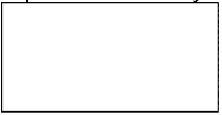
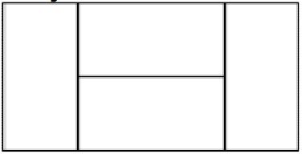
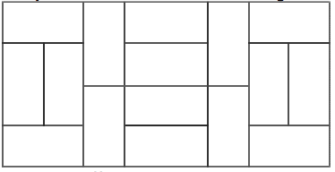
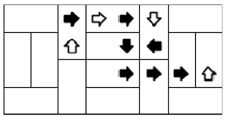

## 문제

Slavko je upravo popločao svoju kuhinju na matematički zanimljiv način. Na početku je njegova kuhinja jedna pločica oblika pravokutnika dimenzija 1x2 kao na slici:

Zatim je N puta podijelio svaku pločicu na 4 manje pločice na sljedeći način. Nakon jedne podjele dobivamo pravokutnik dimenzija 2x4:

Nakon druge podjele tako dobivamo pravokutnik dimenzija 4x8:

Nakon konačnog popločenja kuhinju možemo promatrati kao koordinatni sustav gdje svaka pločica pokriva točno dva polja. Polje u gornjem lijevom kutu nalazi se u prvom retku i prvom stupcu te ima koordinate (1, 1), dok polje u donjem desnom kutu ima koordinate (2N, 2N+1).

Nakon što je popločio kuhinju Slavko je prošetao po njenim poljima od početnog polja (R, S) nizom pomaka na jedno od 4 polja susjedna trenutačnome. Pomake predstavljamo znakovima:

* 'L' za pomak na susjedno polje lijevo.
* 'R' za pomak na susjedno polje desno.
* 'U' za pomak na susjedno polje gore.
* 'D' za pomak na susjedno polje dolje.

Nakon svakog Slavkovog pomaka odredite je li prešao između dvije pločice.

## 입력

U prvom retku nalazi se prirodan broj N (0 ≤ N ≤ 20).

U drugom retku ulaza nalaze se dva prirodna broja R i S (1 ≤ R ≤ 2N, 1 ≤ S ≤ 2N+1), redak i stupac polja u kojemu se Slavko na početku nalazi.

U trećem retku ulaza nalazi se niz Slavkovih pomaka, označenih znakovima 'L', 'R', 'D' i 'U'. Niz pomaka neće biti duži od 100 000 znakova. Slavko neće napraviti pomak izvan pravokutnika.

## 출력

U jedinom retku ispišite niz znakova tako da je i-ti znak jednak 'Y' ako je Slavko i-tim pomakom prešao između dvije pločice, a 'N' ako je ostao na istoj pločici.

## 힌트

Slavkov put izgleda ovako:

Zacrnjenim pomacima Slavko je prešao između dvije pločice.
