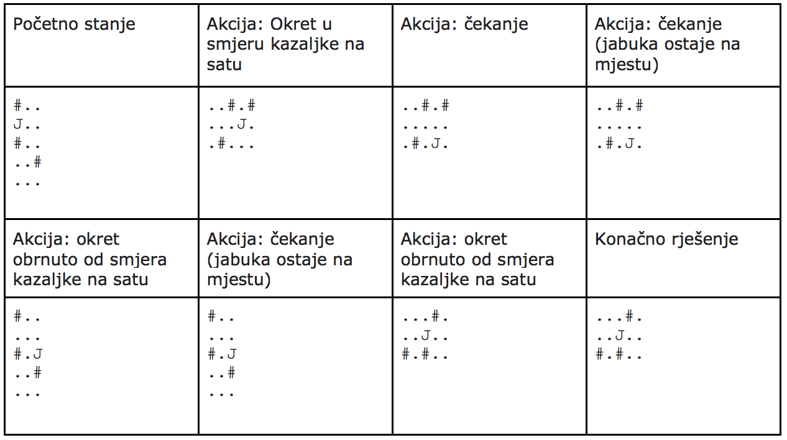

## 문제

Mirko i Slavko bave se izradom mobilnih aplikacija. Nakon izrade neočekivano dobro prihvaćene aplikacije FotoLektira koja na temelju nekoliko rečenica radi stilsku analizu knjige, ekipa je odlučna napraviti još jednu uspješnicu.

Protitip nove igre koju razvijaju ima R x S ploču na kojoj su polja ili prazna ili zablokirana. Jedno od polja sadrži jabuku koja uvijek pada u smjeru gravitacije. U svakoj sekundi igrač može ekran okrenuti za 90 stupnjeva u smjeru kazaljke na satu, za 90 stupnjeva obrnuto od smjera kazaljke na satu ili može pričekati (ne napraviti ništa). Nakon toga jabuka padne jedno polje prema dolje (u smjeru gravitacije), ali samo ako polje ispod jabuke postoji (nije izvan ploče) i prazno je - inače jabuka ostaje na mjestu.

Vaš zadatak je napraviti simulator igre, odnosno za početno stanje i niz koraka ispisati konačno stanje. Sljedeća tablica ilustrira jedan jednostavni primjer ove igre. U tablici znak ‘#’ označava blokirano polje, znak ‘.’ označava prazno polje, dok znak ‘J’ označava poziciju jabuke.

## 입력

U prvom retku nalaze se prirodni brojevi R i S (3 ≤ R, S ≤ 1000), broj redaka i stupaca ploče. U sljedećih R redaka nalazi se niz od točno S znakova gdje je svaki znak veliko slovo ‘J’, ‘.’ (točka) ili ‘#’. Na ploči će se nalaziti točno jedan znak ‘J’.

U posljednjem retku ulaza nalazi se niz od najviše 1 000 000 znakova -- niz koraka. Svaki znak toga niza bit će jedan od sljedećih:

* ‘R’ - označava okret ekrana u smjeru kazaljke na satu
* ‘L’ - označava okret ekrana u smjeru obrnutom od smjera kazaljke na satu
* ‘P’ - označava čekanje

## 출력

Ispišite R x S ili S x R tablicu (ovisno o konačnoj rotaciji) krajnjeg stanja ploče.
