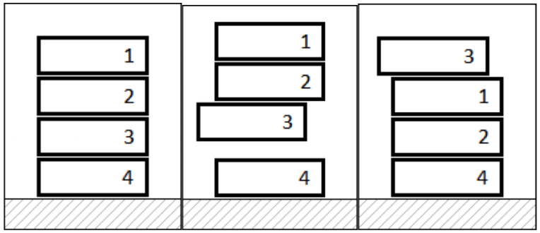

## 문제

Unatoč tome što je uzoran učenik, Mirko je uvijek imao problema s čitanjem lektira. Ove godine odlučio je tome stati na kraj. Nabavio je svih N knjiga koje profesorica može odabrati za lektire, označene prirodnim brojevima od 1 do N. Zatim ih je sve smjestio u jedan toranj od najmanje do najveće, tj. knjiga s oznakom 1 je na vrhu tornja.

Svaki put kada mu profesorica zada za lektiru knjigu Li, Mirko je mora izvući iz tornja kako bi je pročitao, što obavlja tako da podigne sve knjige koje se nalaze iznad knjige Li, izvuče knjigu Li, te spusti podignute knjige na toranj. Nakon što Mirko pročita knjigu Li, vraća je na vrh tornja. Knjigu Li također smatramo podignutom.

  
Mirko čita lektiru s oznakom 3

Na primjer, pogledajmo toranj na slici. Ako je prva lektira knjiga označena brojem 3, Mirko će podići tri knjige označene brojevima 1, 2 i 3. Zatim će spustiti knjige označene brojevima 1 i 2. Nakon što pročita knjigu označenu brojem 3, stavit će je na vrh tornja.

Poznat je niz lektira L koje će profesorica zadati. Izračunajte koliko će knjiga Mirko podići ove školske godine kako bi pročitao sve lektire.

## 입력

U prvom retku nalaze se prirodni brojevi N i Q (1 ≤ N, Q ≤ 100 000), broj knjiga i broj lektira.

U drugom retku nalazi se niz od Q prirodnih brojeva L (1 ≤ Li ≤ N), zadane lektire.

Napomena: Moguće je da neka knjiga nikad ne bude odabrana za lektiru. Ujedno je moguće da neka knjiga bude odabrana više puta, u kojem slučaju je Mirko mora ponovo pročitati.

## 출력

U prvom retku ispišite točno jedan prirodan broj, ukupan broj knjiga koje će Mirko podići.

## 힌트

(1,2,3,4) -> (1,2,3,4), podignuta je samo knjiga 1  
(1,2,3,4) -> (3,1,2,4), podignute su knjige 1, 2 i 3  
(3,1,2,4) -> (2,3,1,4), podignute su knjige 1, 2 i 3  
Ukupno je Mirko podigao 1+3+3=7 knjiga.
