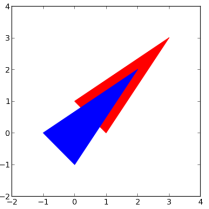

## 문제

Kad je Hrvatski savez informatičara objavio rang listu s prvoga kruga ovog natjecanja, jedan mladi gospodin prišuljao se i pitao: “A gdje je pečat?”

Da se to ne bi opet dogodilo, ovaj put na rang listu utisnut ćemo pečat ne jednom, nego dvaput. Pečat ima oblik konveksnoga poligona i mjesta na kojima je udaren mogu se preklapati. Vaš je zadatak izračunati ukupni opseg dijela papira prekrivenog otiskom pečata.

## 입력

U prvome retku nalazi se prirodan broj N (3 ≤ N ≤ 100 000), broj vrhova pečata.

Svaki od sljedećih N redaka sadrži cijele brojeve x, y (0 ≤ x, y < 109 ), koordinate vrha prvoga pečata utisnutog na papir. Vrhovi su dani u smjeru kazaljke na satu i nikoja tri nisu kolinearna.

U sljedećem retku nalaze se cijeli brojevi Dx, Dy (-109 < Dx, Dy < 109 ) koji čine vektor za koji je drugi pečat pomaknut u odnosu na prvi.

## 출력

U jedini redak ispišite traženi opseg. Dozvoljeno je odstupanje od službenog rješenja za 0.001.

## 힌트

