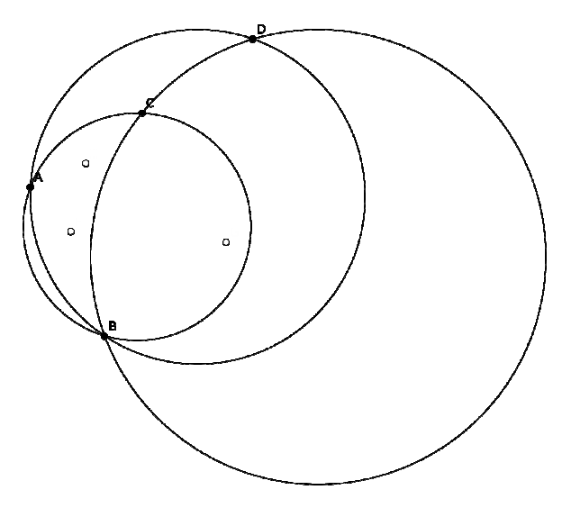

## 문제

Poznata je Arhimedova rečenica: „Ne diraj moje krugove!“

Manje je poznato što je on zapravo rješavao u pijesku. On je nacrtao N crnih i M bijelih točaka.

Pokušavao je riješiti sljedeći problem: koja kružnica određena s tri crne točke unutar sebe sadrži najviše bijelih točaka? Smatramo da je neka bijela točka unutar kružnice ako je dio kruga koji ta kružnica omeđuje.

Mladi Andro saznao je za Arhimedov problem te je odlučio riješiti taj problem star preko 2000 godina. Andro je zbunjen kao i obično pa mu je potrebna vaša pomoć. Pomognite mu i pronađite najveći broj bijelih točaka koje se nalaze unutar neke kružnice koja je opisana trokutu čiji su vrhovi tri crne točke.

  
Slika predstavlja primjer gdje je rješenje 3, konkretnije kružnica definirana točkama A, B i C sadrži tri bijele točke. Kružnica A, B, D također sadrži 3 bijele točke. Kružnica B, C, D sadrži jednu točku. Primjetite da ne postoji kružnica koja prolazi točkama A, C, D.

## 입력

U prvom retku nalazi se prirodan broj N (1 ≤ N ≤ 200), broj crnih točaka.

U sljedećih N redaka nalaze se koordinate crnih točaka, dva cijela broja koja su po apsolutnoj vrijednosti manja od 10 000.

U sljedećem retku nalazi se prirodan broj M (1 ≤ M ≤ 200), broj bijelih točaka.

U sljedećih M redaka nalaze se koordinate bijelih točaka, dva cijela broja koja su po apsolutnoj vrijednosti manja od 10 000.

Sve točke u ulazu su različite, niti jedna bijela točka ne leži na nekoj od kružnica određenih s tri crne točke.

## 출력

U prvom i jedinom retku ispišite najveći broj bijelih točaka koje se nalaze unutar kružnice određene s tri crne točke.
