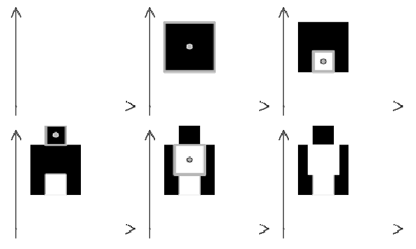

## 문제

Neobičan slikar slika neobičnu sliku. Njegovo platno možemo zamisliti kao koordinatnu ravninu. Ono je na početku stvaranja slike bijele boje, a slikar će sliku stvoriti ponavljanjem sljedećeg postupka N puta:

* Slikar odabire proizvoljne cjelobrojne koordinate x i y.
* Zatim pronalazi najveći kvadrat stranica paralelnih s koordinatnim osima, centriran u točki (x, y), i to takav da je cijeli kvadrat na postojećoj slici iste boje. Međutim, stranica kvadrata ne smije biti veća od zadanog broja D.
* Slikar zatim cijeli kvadrat preboja u crno ako je bio bijele boje, odnosno u bijelo ako je bio crne boje.

  
Slike prikazuju prvi primjer test podataka

Napišite program koji će izračunati ukupnu površinu slike obojane crnom bojom nakon što je slika gotova. Ta površina ne uključuje crnu boju koja je kasnije prekrivena bijelom bojom.

## 입력

U prvom redu nalaze se dva prirodna broja, N i D (1 ≤ N ≤ 1000, 2 ≤ D ≤ 106 ), broj kvadrata koje će slikar nacrtati, te najveća dopuštena duljina stranice kvadrata. Broj D bit će paran.

U svakom od sljedećih N redova nalaze se po dva cijela broja X i Y (-106 ≤ X, Y ≤ 106 ), koordinate centra pojedinog kvadrata.

## 출력

U prvom i jedinom redu izlaza potrebno je ispisati ukupnu površinu slike obojane crnom bojom.
