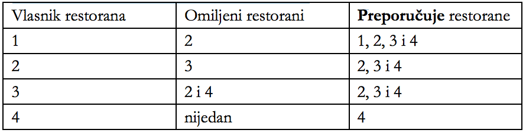

## 문제

U Lukinom gradu nalazi se N restorana označenih brojevima od 1 do N, za svakog se pronađe ponešto. Tako i vlasnici restorana također imaju svoje omiljene restorane koje rado posjećuju. Ako vlasnika restorana pitamo za preporuku, on će, osim svojeg restorana, preporučiti i svoje omiljene restorane, ali i sve restorane koje bi preporučili njihovi vlasnici.

Donja tablica prikazuje jedan primjer sa četiri restorana:

Luka planira obići nekoliko restorana i to na sljedeći način:

* Prvi restoran odabrat će proizvoljno.
* Svaki slijedeći restoran odabrat će tako da će pitati vlasnika trenutnog restorana za preporuku, te od preporučenih restorana odabrati jedan u kojem još nije bio.
* Luka može u bilo kojem trenutku završiti s obilaskom restorana.

Svaki restoran A ima dvije cijene XA i YA za glavni meni. Prilikom ulaska u restoran, vlasnik će Luku upitati tko mu je preporučio njegov restoran. Ukoliko je ta osoba vlasnik restorana B, tada će Luka platiti:

* XA kuna, ako vlasnik restorana A preporučuje restoran B,
* YA kuna, inače. Ovaj iznos Luka plaća i u prvom restoranu.

Neka je K najveći broj restorana koje Luka može posjetiti na ovaj način. Za svaki broj k između 1 i K potrebno je izračunati koliko najmanje kuna treba Luki ako želi posjetiti točno k restorana.

## 입력

U prvom redu nalazi se cijeli broj N (1 ≤ N ≤ 1000), broj restorana.

U svakom od sljedećih N redova nalazi se nekoliko cijelih brojeva.

Prva dva broja u i-tom redu su cijene glavnog menija Xi , Yi (1 ≤ Xi , Yi ≤ 10000), dok je treći broj Oi (0 ≤ Oi < N) broj restorana omiljenih vlasniku restorana i. Preostalih Oi brojeva predstavlja oznake njegovih omiljenih restorana; te oznake su međusobno različite i nijedna nije jednaka i.

## 출력

Ako je K najveći broj restorana koje Luka može posjetiti, tada je potrebno ispisati K redova. U k-ti red potrebno je ispisati najmanji broj kuna koje Luka mora platiti da bi posjetio točno k restorana.

## 힌트

Najjeftiniji način za posjetiti jedan restoran je posjetiti restoran 1 (200 kn).  
Najjeftiniji način za posjetiti dva restorana je posjetiti restoran 3 (250 kn), pa zatim restoran 2 (200 kn).  
Najjeftiniji način za posjetiti tri restorana je posjetiti restoran 1 (200 kn), restoran 3 (250 kn), te konačno restoran 2 (200 kn).  
Najjeftiniji način za posjetiti četiri restorana je posjetiti restoran 1 (200 kn), restoran 3 (250 kn), restoran 2 (200 kn), te konačno restoran 4 (300 kn).
